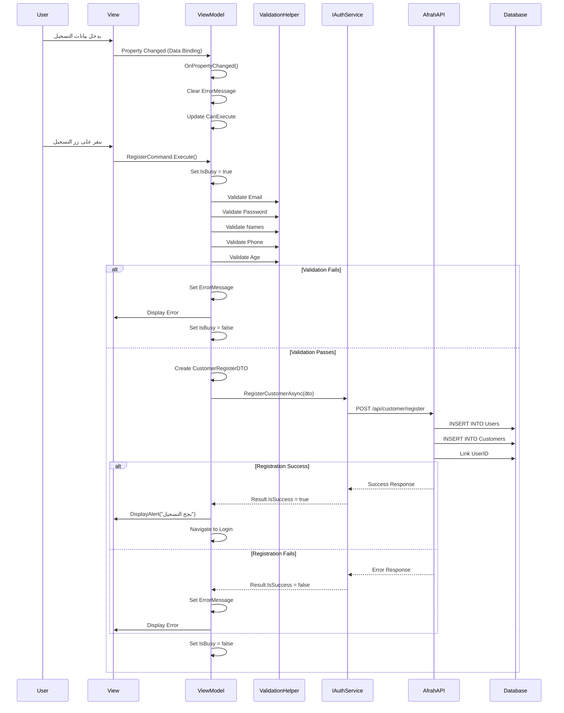
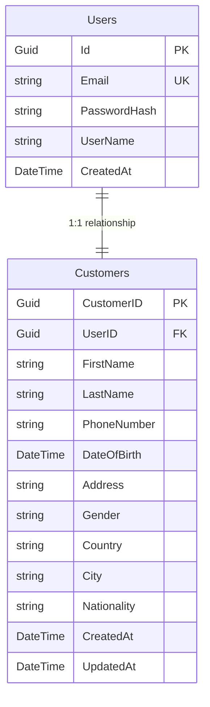

# Design Document: CustomerRegisterViewModel

## Overview

يوفر CustomerRegisterViewModel طبقة منطق العرض (Presentation Logic Layer) لشاشة تسجيل العميل الجديد في تطبيق Afrah MAUI. يعمل كوسيط بين واجهة المستخدم (View) وطبقة الخدمات (Services Layer)، حيث يدير حالة النموذج، التحقق من صحة البيانات، والتفاعل مع API لإنشاء حساب عميل جديد.

### المسؤوليات الرئيسية

1. **إدارة حالة النموذج**: توفير خصائص قابلة للربط (Bindable Properties) لجميع حقول التسجيل
2. **التحقق من صحة البيانات**: التحقق من صحة المدخلات قبل إرسالها إلى API
3. **التفاعل مع API**: استدعاء IAuthService لإنشاء سجلين في قاعدة البيانات (Users و Customers)
4. **إدارة حالة UI**: التحكم في حالات التحميل والأخطاء والتعطيل
5. **التنقل**: إدارة الانتقال بين الشاشات بعد نجاح أو فشل التسجيل

### السياق التقني

- **Framework**: .NET MAUI
- **Pattern**: MVVM (Model-View-ViewModel)
- **Base Class**: BaseViewModel (يوفر INotifyPropertyChanged و IsBusy و IsLoading و ErrorMessage)
- **Dependencies**: IAuthService, INavigationService, ValidationHelper
- **Target DTO**: CustomerRegisterDTO (يحتوي على بيانات User و Customer)

## Architecture

### Component Diagram

```mermaid
graph TB
    View[CustomerRegisterPage<br/>XAML View]
    VM[CustomerRegisterViewModel<br/>Presentation Logic]
    Base[BaseViewModel<br/>INotifyPropertyChanged]
    Auth[IAuthService<br/>Authentication Service]
    Nav[INavigationService<br/>Navigation Service]
    Val[ValidationHelper<br/>Validation Logic]
    DTO[CustomerRegisterDTO<br/>Data Transfer Object]
    API[AfrahAPI<br/>Backend Service]
    
    View -->|Data Binding| VM
    View -->|Command Binding| VM
    VM --|Inherits| Base
    VM -->|Uses| Auth
    VM -->|Uses| Nav
    VM -->|Uses| Val
    VM -->|Creates| DTO
    Auth -->|Sends| DTO
    Auth -->|HTTP Request| API
    API -->|Creates| Users[(Users Table)]
    API -->|Creates| Customers[(Customers Table)]
    Users -.->|1:1 Relationship| Customers
    
    style VM fill:#e1f5ff
    style Base fill:#fff4e1
    style Auth fill:#ffe1e1
    style API fill:#e1ffe1
```

### Architectural Layers

1. **Presentation Layer** (CustomerRegisterViewModel)
   - يدير حالة UI والتفاعل مع المستخدم
   - يطبق قواعد التحقق من الصحة
   - يحول بيانات النموذج إلى DTO

2. **Service Layer** (IAuthService)
   - يتعامل مع HTTP requests إلى API
   - يدير المصادقة والتسجيل
   - يعالج الاستجابات والأخطاء

3. **Data Layer** (API Backend)
   - ينشئ سجل في جدول Users (بيانات المصادقة)
   - ينشئ سجل في جدول Customers (بيانات العميل)
   - يربط السجلين بعلاقة 1:1 عبر UserID

### Data Flow



## Components and Interfaces

### CustomerRegisterViewModel

#### Properties

**Data Properties** (Bindable to UI)
```csharp
public string Email { get; set; }
public string Password { get; set; }
public string ConfirmPassword { get; set; }
public string FirstName { get; set; }
public string LastName { get; set; }
public string PhoneNumber { get; set; }
public DateTime DateOfBirth { get; set; }
public string Address { get; set; }
public string Gender { get; set; }
public string Country { get; set; }
public string City { get; set; }
public string Nationality { get; set; }
```

**UI State Properties**
```csharp
public bool IsPasswordVisible { get; set; }
public bool IsConfirmPasswordVisible { get; set; }
public ObservableCollection<string> GenderOptions { get; set; }
```

**Inherited from BaseViewModel**
```csharp
public bool IsBusy { get; set; }
public bool IsLoading { get; set; }
public string ErrorMessage { get; set; }
```

#### Commands

```csharp
public Command RegisterCommand { get; }
public Command NavigateToLoginCommand { get; }
public Command TogglePasswordVisibilityCommand { get; }
public Command ToggleConfirmPasswordVisibilityCommand { get; }
```

#### Constructor

```csharp
public CustomerRegisterViewModel(
    IAuthService authService,
    INavigationService navigationService,
    ValidationHelper validationHelper)
```

**Responsibilities**:
- التحقق من أن جميع التبعيات ليست null (throw ArgumentNullException)
- تهيئة جميع الأوامر (Commands)
- تهيئة GenderOptions بقيم من Constants
- تعيين DateOfBirth إلى تاريخ يجعل المستخدم 18 سنة

#### Methods

**Private Methods**

```csharp
private async Task RegisterAsync()
```
- يتحقق من IsBusy لتجنب التنفيذ المتعدد
- يعين IsBusy و IsLoading إلى true
- يستدعي ValidateInput()
- ينشئ CustomerRegisterDTO
- يستدعي IAuthService.RegisterCustomerAsync()
- يعرض رسالة النجاح وينتقل إلى Login عند النجاح
- يعين ErrorMessage عند الفشل
- يعين IsBusy و IsLoading إلى false في finally block

```csharp
private bool CanRegister()
```
- يتحقق من أن جميع الحقول المطلوبة ليست فارغة
- يتحقق من أن IsBusy = false
- يُستخدم لتحديد حالة RegisterCommand.CanExecute

```csharp
private bool ValidateInput()
```
- يستدعي ValidationHelper لكل حقل
- يتحقق من تطابق Password و ConfirmPassword
- يعين ErrorMessage عند وجود خطأ
- يرجع true إذا كانت جميع التحققات ناجحة

```csharp
private void ClearFieldError()
```
- يمسح ErrorMessage عند تغيير أي خاصية
- يُستدعى من property setters

### IAuthService Interface

```csharp
public interface IAuthService
{
    Task<Result<RegisterResponseDTO>> RegisterCustomerAsync(CustomerRegisterDTO dto);
}
```

**Responsibilities**:
- إرسال HTTP POST request إلى `/api/customer/register`
- معالجة الاستجابة وإرجاع Result<RegisterResponseDTO>
- التعامل مع أخطاء الشبكة والخادم

**Backend Behavior** (من المتطلبات):
- ينشئ سجل في جدول Users مع Email و Password (hashed)
- ينشئ سجل في جدول Customers مع جميع البيانات الشخصية
- يربط Customer.UserID بـ User.Id (علاقة 1:1)

### INavigationService Interface

```csharp
public interface INavigationService
{
    Task NavigateToAsync(string route);
}
```

**Usage**:
- `NavigateToAsync(Constants.LoginRoute)` - بعد نجاح التسجيل
- `NavigateToAsync(Constants.LoginRoute)` - عند النقر على NavigateToLoginCommand

### ValidationHelper Class

```csharp
public class ValidationHelper
{
    bool IsValidEmail(string email);
    bool IsValidPassword(string password);
    bool IsValidName(string name);
    bool IsValidPhoneNumber(string phoneNumber);
    int CalculateAge(DateTime dateOfBirth);
}
```

**Validation Rules**:
- Email: يجب أن يكون بصيغة صحيحة (contains @ and domain)
- Password: 6 أحرف على الأقل
- Names: بين 2 و 50 حرف
- PhoneNumber: 10-15 رقم
- Age: 18 سنة أو أكثر

## Data Models

### CustomerRegisterDTO

```csharp
public class CustomerRegisterDTO
{
    // User Data (for Users Table)
    public string Email { get; set; }
    public string Password { get; set; }
    public string ConfirmPassword { get; set; }
    
    // Customer Data (for Customers Table)
    public string FirstName { get; set; }
    public string LastName { get; set; }
    public string PhoneNumber { get; set; }
    public DateTime DateOfBirth { get; set; }
    public string? Address { get; set; }
    public string? Gender { get; set; }
    public string? Country { get; set; }
    public string? City { get; set; }
    public string? Nationality { get; set; }
}
```

**Mapping**:
- يتم إنشاء DTO في RegisterAsync() من خصائص ViewModel
- يتم إرسال DTO إلى IAuthService.RegisterCustomerAsync()
- API يقسم البيانات بين جدولين:
  - **Users Table**: Email, Password (hashed), UserID (generated)
  - **Customers Table**: FirstName, LastName, PhoneNumber, DateOfBirth, Address, Gender, Country, City, Nationality, UserID (foreign key)

### Database Schema



### Result<T> Pattern

```csharp
public class Result<T>
{
    public bool IsSuccess { get; set; }
    public T Data { get; set; }
    public string ErrorMessage { get; set; }
}
```

**Usage**:
- IAuthService يرجع `Result<RegisterResponseDTO>`
- ViewModel يتحقق من `IsSuccess` لتحديد المسار
- `ErrorMessage` يُعرض للمستخدم عند الفشل


## Correctness Properties

*A property is a characteristic or behavior that should hold true across all valid executions of a system-essentially, a formal statement about what the system should do. Properties serve as the bridge between human-readable specifications and machine-verifiable correctness guarantees.*

### Property 1: Property Change Notification

*For any* bindable property (Email, Password, ConfirmPassword, FirstName, LastName, PhoneNumber, DateOfBirth, Address, Gender, Country, City, Nationality), when its value changes, the ViewModel should raise PropertyChanged event with the correct property name.

**Validates: Requirements 1.2**

### Property 2: Error Message Clearing on Property Change

*For any* bindable property, when its value changes and ErrorMessage is not empty, the ViewModel should clear the ErrorMessage.

**Validates: Requirements 1.3**

### Property 3: CanExecute Update on Property Change

*For any* required property (Email, Password, ConfirmPassword, FirstName, LastName, PhoneNumber, DateOfBirth, Gender), when its value changes, the RegisterCommand.CanExecute state should be re-evaluated.

**Validates: Requirements 1.4**

### Property 4: Input Validation Completeness

*For any* CustomerRegisterViewModel with invalid input data (empty email, invalid email format, short password, mismatched passwords, invalid names, invalid phone, underage, or missing gender), when RegisterCommand is invoked, the ViewModel should set an appropriate ErrorMessage and should not call IAuthService.RegisterCustomerAsync.

**Validates: Requirements 2.1, 2.2, 2.3, 2.4, 2.5, 2.6, 2.7, 2.8**

### Property 5: Successful Registration Flow

*For any* CustomerRegisterViewModel with valid input data, when RegisterCommand is invoked and IAuthService returns success, the ViewModel should:
1. Set IsBusy and IsLoading to true at the start
2. Create a CustomerRegisterDTO with all property values correctly mapped
3. Call IAuthService.RegisterCustomerAsync with the DTO
4. Display a success alert message
5. Navigate to LoginRoute

**Validates: Requirements 3.1, 3.2, 3.3, 3.7, 3.8**

### Property 6: Failed Registration Error Handling

*For any* CustomerRegisterViewModel with valid input data, when RegisterCommand is invoked and IAuthService returns failure with an error message, the ViewModel should set ErrorMessage to the error message from the result.

**Validates: Requirements 3.9**

### Property 7: IsBusy State Cleanup

*For any* RegisterCommand execution (regardless of success or failure), when the execution completes, the ViewModel should set IsBusy and IsLoading to false.

**Validates: Requirements 3.10**

### Property 8: RegisterCommand CanExecute Logic

*For any* CustomerRegisterViewModel, the RegisterCommand should be enabled if and only if all required fields (Email, Password, ConfirmPassword, FirstName, LastName, PhoneNumber, DateOfBirth, Gender) are not empty/null and IsBusy is false.

**Validates: Requirements 4.2, 4.3, 4.4**

### Property 9: Password Visibility Toggle Idempotence

*For any* CustomerRegisterViewModel, executing TogglePasswordVisibilityCommand twice should return IsPasswordVisible to its original state. Similarly, executing ToggleConfirmPasswordVisibilityCommand twice should return IsConfirmPasswordVisible to its original state.

**Validates: Requirements 5.3, 5.4**

### Property 10: Navigation to Login

*For any* CustomerRegisterViewModel, when NavigateToLoginCommand is invoked, the ViewModel should call INavigationService.NavigateToAsync with Constants.LoginRoute.

**Validates: Requirements 6.2**

### Property 11: Constructor Null Parameter Validation

*For any* constructor parameter (IAuthService, INavigationService, ValidationHelper), when it is null, the CustomerRegisterViewModel constructor should throw ArgumentNullException with the parameter name.

**Validates: Requirements 7.2**

## Error Handling

### Validation Errors

**Client-Side Validation** (في ViewModel):
- يتم التحقق من جميع الحقول قبل إرسال الطلب إلى API
- يتم عرض رسائل الخطأ باللغة العربية من Constants
- لا يتم استدعاء API إذا فشل التحقق

**Error Messages Mapping**:
```csharp
// Email validation
if (string.IsNullOrWhiteSpace(Email))
    ErrorMessage = Constants.ErrorFieldRequired;
else if (!_validationHelper.IsValidEmail(Email))
    ErrorMessage = Constants.ErrorInvalidEmail;

// Password validation
if (string.IsNullOrWhiteSpace(Password))
    ErrorMessage = Constants.ErrorPasswordRequired;
else if (!_validationHelper.IsValidPassword(Password))
    ErrorMessage = Constants.ErrorPasswordTooShort;

// Password confirmation
if (Password != ConfirmPassword)
    ErrorMessage = Constants.ErrorPasswordsNotMatch;

// Name validation
if (!_validationHelper.IsValidName(FirstName) || !_validationHelper.IsValidName(LastName))
    ErrorMessage = Constants.ErrorNameTooShort;

// Phone validation
if (!_validationHelper.IsValidPhoneNumber(PhoneNumber))
    ErrorMessage = Constants.ErrorInvalidPhoneNumber;

// Age validation
if (_validationHelper.CalculateAge(DateOfBirth) < Constants.MinAge)
    ErrorMessage = Constants.ErrorAgeRestriction;

// Gender validation
if (string.IsNullOrWhiteSpace(Gender))
    ErrorMessage = Constants.ErrorGenderRequired;
```

### API Errors

**Network Errors**:
- **No Internet**: عرض `Constants.ErrorNoInternet`
- **Timeout**: عرض `Constants.ErrorTimeout`
- **Server Error (5xx)**: عرض `Constants.ErrorServerError`

**Business Logic Errors** (من API):
- **Email Already Exists**: عرض رسالة من API response
- **Phone Already Exists**: عرض رسالة من API response
- **Invalid Data**: عرض رسالة من API response

**Error Handling Pattern**:
```csharp
try
{
    IsBusy = true;
    IsLoading = true;
    ErrorMessage = string.Empty;
    
    // Validation
    if (!ValidateInput())
        return;
    
    // API Call
    var result = await _authService.RegisterCustomerAsync(dto);
    
    if (result.IsSuccess)
    {
        // Success handling
    }
    else
    {
        ErrorMessage = result.ErrorMessage;
    }
}
catch (HttpRequestException)
{
    ErrorMessage = Constants.ErrorNoInternet;
}
catch (TaskCanceledException)
{
    ErrorMessage = Constants.ErrorTimeout;
}
catch (Exception)
{
    ErrorMessage = Constants.ErrorUnexpected;
}
finally
{
    IsBusy = false;
    IsLoading = false;
}
```

### Constructor Validation

```csharp
public CustomerRegisterViewModel(
    IAuthService authService,
    INavigationService navigationService,
    ValidationHelper validationHelper)
{
    _authService = authService ?? throw new ArgumentNullException(nameof(authService));
    _navigationService = navigationService ?? throw new ArgumentNullException(nameof(navigationService));
    _validationHelper = validationHelper ?? throw new ArgumentNullException(nameof(validationHelper));
    
    // Initialize commands and properties
}
```

### UI State Management

**IsBusy Pattern**:
- يُستخدم لمنع التنفيذ المتعدد للأوامر
- يُعطل RegisterCommand أثناء العملية
- يُعرض مؤشر تحميل في UI

**ErrorMessage Pattern**:
- يُمسح عند تغيير أي خاصية
- يُعرض في UI بلون أحمر
- يُعين عند فشل التحقق أو فشل API

## Testing Strategy

### Dual Testing Approach

سنستخدم نهجاً مزدوجاً للاختبار يجمع بين:

1. **Unit Tests**: للتحقق من أمثلة محددة، حالات حدية، وشروط الخطأ
2. **Property-Based Tests**: للتحقق من الخصائص العامة عبر جميع المدخلات

كلا النوعين ضروري ومكمل للآخر:
- **Unit tests** تركز على حالات محددة ونقاط التكامل
- **Property tests** تتعامل مع تغطية شاملة للمدخلات عبر التوليد العشوائي

### Unit Testing

**Test Framework**: xUnit أو NUnit
**Mocking Framework**: Moq

**Unit Test Categories**:

1. **Constructor Tests**
   - التحقق من رمي ArgumentNullException عند null parameters
   - التحقق من تهيئة Commands بشكل صحيح
   - التحقق من تهيئة GenderOptions
   - التحقق من DateOfBirth الافتراضي (18 سنة)

2. **Property Change Tests**
   - التحقق من PropertyChanged event لكل خاصية
   - التحقق من مسح ErrorMessage عند التغيير
   - التحقق من تحديث CanExecute

3. **Validation Tests**
   - اختبار كل قاعدة تحقق بشكل منفصل
   - اختبار حالات حدية (empty, null, invalid format)
   - اختبار رسائل الخطأ الصحيحة

4. **Command Tests**
   - اختبار RegisterCommand مع بيانات صحيحة
   - اختبار RegisterCommand مع بيانات غير صحيحة
   - اختبار NavigateToLoginCommand
   - اختبار Toggle commands

5. **Integration Tests**
   - اختبار التدفق الكامل من UI إلى API (باستخدام mocks)
   - اختبار معالجة الأخطاء من API

**Example Unit Tests**:
```csharp
[Fact]
public void Constructor_WithNullAuthService_ThrowsArgumentNullException()
{
    // Arrange & Act & Assert
    Assert.Throws<ArgumentNullException>(() => 
        new CustomerRegisterViewModel(null, mockNav, mockVal));
}

[Fact]
public void DateOfBirth_DefaultValue_Makes18YearsOld()
{
    // Arrange
    var vm = new CustomerRegisterViewModel(mockAuth, mockNav, mockVal);
    
    // Act
    var age = mockVal.CalculateAge(vm.DateOfBirth);
    
    // Assert
    Assert.Equal(18, age);
}

[Fact]
public void GenderOptions_AfterConstruction_ContainsMaleAndFemale()
{
    // Arrange & Act
    var vm = new CustomerRegisterViewModel(mockAuth, mockNav, mockVal);
    
    // Assert
    Assert.Contains(Constants.GenderMale, vm.GenderOptions);
    Assert.Contains(Constants.GenderFemale, vm.GenderOptions);
    Assert.Equal(2, vm.GenderOptions.Count);
}
```

### Property-Based Testing

**Test Framework**: FsCheck (for C#)
**Configuration**: Minimum 100 iterations per test

**Property Test Implementation**:

كل property test يجب أن:
1. يشير إلى رقم الخاصية في design document
2. يستخدم tag بالصيغة: `Feature: customer-register-viewmodel, Property {number}: {property_text}`
3. يُنفذ على الأقل 100 iteration

**Example Property Tests**:

```csharp
[Property]
[Tag("Feature: customer-register-viewmodel, Property 1: Property Change Notification")]
public Property PropertyChange_RaisesPropertyChangedEvent()
{
    return Prop.ForAll(
        Arb.From<string>(),
        (value) =>
        {
            // Arrange
            var vm = new CustomerRegisterViewModel(mockAuth, mockNav, mockVal);
            var propertyNames = new[] { "Email", "Password", "FirstName", "LastName", 
                                       "PhoneNumber", "Address", "Gender", "Country", 
                                       "City", "Nationality" };
            
            foreach (var propName in propertyNames)
            {
                var eventRaised = false;
                vm.PropertyChanged += (s, e) => 
                {
                    if (e.PropertyName == propName)
                        eventRaised = true;
                };
                
                // Act
                var property = vm.GetType().GetProperty(propName);
                property.SetValue(vm, value);
                
                // Assert
                if (!eventRaised)
                    return false;
            }
            
            return true;
        });
}

[Property]
[Tag("Feature: customer-register-viewmodel, Property 2: Error Message Clearing on Property Change")]
public Property PropertyChange_ClearsErrorMessage()
{
    return Prop.ForAll(
        Arb.From<string>(),
        Arb.From<string>(),
        (errorMsg, newValue) =>
        {
            // Arrange
            var vm = new CustomerRegisterViewModel(mockAuth, mockNav, mockVal);
            vm.ErrorMessage = errorMsg;
            
            // Act
            vm.Email = newValue;
            
            // Assert
            return string.IsNullOrEmpty(vm.ErrorMessage);
        });
}

[Property]
[Tag("Feature: customer-register-viewmodel, Property 4: Input Validation Completeness")]
public Property InvalidInput_SetsErrorAndDoesNotCallAPI()
{
    return Prop.ForAll(
        GenerateInvalidCustomerData(),
        (invalidData) =>
        {
            // Arrange
            var mockAuthService = new Mock<IAuthService>();
            var vm = new CustomerRegisterViewModel(
                mockAuthService.Object, mockNav, mockVal);
            
            // Set invalid data
            SetViewModelProperties(vm, invalidData);
            
            // Act
            vm.RegisterCommand.Execute(null);
            
            // Assert
            var errorSet = !string.IsNullOrEmpty(vm.ErrorMessage);
            var apiNotCalled = mockAuthService.Verify(
                x => x.RegisterCustomerAsync(It.IsAny<CustomerRegisterDTO>()), 
                Times.Never);
            
            return errorSet && apiNotCalled;
        });
}

[Property]
[Tag("Feature: customer-register-viewmodel, Property 9: Password Visibility Toggle Idempotence")]
public Property TogglePasswordVisibility_TwiceReturnsToOriginal()
{
    return Prop.ForAll(
        Arb.From<bool>(),
        (initialValue) =>
        {
            // Arrange
            var vm = new CustomerRegisterViewModel(mockAuth, mockNav, mockVal);
            vm.IsPasswordVisible = initialValue;
            
            // Act
            vm.TogglePasswordVisibilityCommand.Execute(null);
            vm.TogglePasswordVisibilityCommand.Execute(null);
            
            // Assert
            return vm.IsPasswordVisible == initialValue;
        });
}
```

**Custom Generators**:

```csharp
// Generator for invalid customer data
public static Arbitrary<InvalidCustomerData> GenerateInvalidCustomerData()
{
    return Arb.From(
        Gen.OneOf(
            Gen.Constant(new InvalidCustomerData { Email = "" }), // Empty email
            Gen.Constant(new InvalidCustomerData { Email = "invalid" }), // Invalid format
            Gen.Constant(new InvalidCustomerData { Password = "123" }), // Short password
            Gen.Constant(new InvalidCustomerData { 
                Password = "password123", 
                ConfirmPassword = "different" 
            }), // Mismatched passwords
            Gen.Constant(new InvalidCustomerData { FirstName = "A" }), // Short name
            Gen.Constant(new InvalidCustomerData { PhoneNumber = "123" }), // Invalid phone
            Gen.Constant(new InvalidCustomerData { 
                DateOfBirth = DateTime.Now.AddYears(-10) 
            }), // Underage
            Gen.Constant(new InvalidCustomerData { Gender = null }) // Missing gender
        ));
}
```

### Test Coverage Goals

- **Unit Test Coverage**: 80%+ من الكود
- **Property Test Coverage**: جميع الخصائص المحددة في design document
- **Integration Test Coverage**: جميع التدفقات الرئيسية (success, validation failure, API failure)

### Continuous Integration

- تشغيل جميع الاختبارات على كل commit
- فشل البناء إذا فشل أي اختبار
- تقرير تغطية الكود في كل PR

