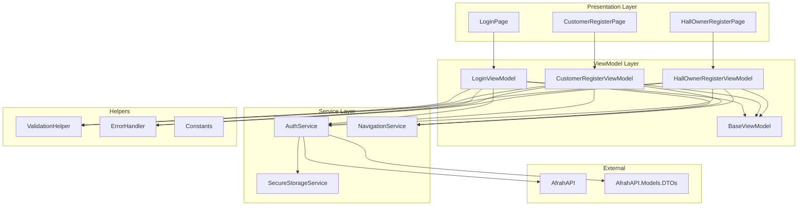

# وثيقة التصميم - شاشات المصادقة والتسجيل

## نظرة عامة (Overview)

هذه الوثيقة تحدد التصميم التفصيلي لشاشات المصادقة والتسجيل في تطبيق AfrahApp المبني باستخدام .NET MAUI. التطبيق يتبع نمط MVVM المعماري ويتصل بـ API موجود مسبقاً (AfrahAPI) لإجراء عمليات المصادقة والتسجيل.

### الأهداف الرئيسية

1. توفير تجربة مستخدم سلسة وآمنة لتسجيل الدخول والتسجيل
2. دعم كامل للغة العربية والتخطيط RTL
3. التحقق من صحة البيانات على مستوى العميل قبل الإرسال للخادم
4. معالجة الأخطاء بشكل واضح ومفهوم للمستخدم
5. تخزين آمن لبيانات المصادقة (JWT Tokens)
6. التوافق مع منصات متعددة (Android, iOS, Windows, MacCatalyst)

### النطاق

التصميم يغطي ثلاث شاشات رئيسية:
- **شاشة تسجيل الدخول (LoginPage)**: للمستخدمين المسجلين مسبقاً
- **شاشة تسجيل العميل (CustomerRegisterPage)**: للعملاء الجدد
- **شاشة تسجيل صاحب الصالة (HallOwnerRegisterPage)**: لأصحاب الصالات الجدد

## البنية المعمارية (Architecture)

### النمط المعماري: MVVM (Model-View-ViewModel)



### مبادئ التصميم

1. **فصل المسؤوليات (Separation of Concerns)**
   - Views: مسؤولة فقط عن العرض والتفاعل مع المستخدم
   - ViewModels: تحتوي على منطق العرض والتحقق من الصحة
   - Services: تتعامل مع العمليات الخارجية (API calls, Storage)

2. **حقن التبعيات (Dependency Injection)**
   - جميع Services و ViewModels مسجلة في DI Container
   - استخدام Interfaces لتسهيل الاختبار والصيانة

3. **مشاركة الكود (Code Reusability)**
   - BaseViewModel يحتوي على الخصائص والوظائف المشتركة
   - ValidationHelper يوفر وظائف التحقق القابلة لإعادة الاستخدام
   - استخدام مباشر لـ DTOs من AfrahAPI.Models.DTOs

4. **الأمان (Security)**
   - استخدام HTTPS فقط
   - تخزين آمن للـ Tokens باستخدام Platform-specific Secure Storage
   - عدم تسجيل البيانات الحساسة (Passwords, Tokens)

## المكونات والواجهات (Components and Interfaces)

### 1. Services

#### IAuthService / AuthService

خدمة المصادقة المسؤولة عن الاتصال بـ API لإجراء عمليات تسجيل الدخول والتسجيل.

```csharp
public interface IAuthService
{
    /// <summary>
    /// تسجيل الدخول باستخدام البريد الإلكتروني أو اسم المستخدم وكلمة المرور
    /// </summary>
    Task<Result<LoginResponseDTO>> LoginAsync(LoginDTO loginDto);
    
    /// <summary>
    /// تسجيل عميل جديد
    /// </summary>
    Task<Result<RegisterResponseDTO>> RegisterCustomerAsync(CustomerRegisterDTO dto);
    
    /// <summary>
    /// تسجيل صاحب صالة جديد
    /// </summary>
    Task<Result<RegisterResponseDTO>> RegisterHallOwnerAsync(HallOwnerRegisterDTO dto);
}

public class AuthService : IAuthService
{
    private readonly HttpClient _httpClient;
    private readonly ISecureStorageService _secureStorage;
    private readonly string _baseUrl;

    public AuthService(HttpClient httpClient, ISecureStorageService secureStorage)
    {
        _httpClient = httpClient;
        _secureStorage = secureStorage;
        _baseUrl = Constants.ApiBaseUrl;
    }

    public async Task<Result<LoginResponseDTO>> LoginAsync(LoginDTO loginDto)
    {
        try
        {
            var json = JsonSerializer.Serialize(loginDto);
            var content = new StringContent(json, Encoding.UTF8, "application/json");
            
            var response = await _httpClient.PostAsync($"{_baseUrl}/api/account/login", content);
            
            if (response.IsSuccessStatusCode)
            {
                var responseJson = await response.Content.ReadAsStringAsync();
                var loginResponse = JsonSerializer.Deserialize<LoginResponseDTO>(responseJson);
                
                // حفظ Token في التخزين الآمن
                await _secureStorage.SaveTokenAsync(loginResponse.Token);
                await _secureStorage.SaveRefreshTokenAsync(loginResponse.RefreshToken);
                await _secureStorage.SaveUserInfoAsync(loginResponse.UserInfo);
                
                return Result<LoginResponseDTO>.Success(loginResponse);
            }
            else if (response.StatusCode == System.Net.HttpStatusCode.Unauthorized)
            {
                return Result<LoginResponseDTO>.Failure("البريد الإلكتروني أو كلمة المرور غير صحيحة");
            }
            else if (response.StatusCode == System.Net.HttpStatusCode.InternalServerError)
            {
                return Result<LoginResponseDTO>.Failure("حدث خطأ في الخادم، يرجى المحاولة لاحقاً");
            }
            else
            {
                var errorContent = await response.Content.ReadAsStringAsync();
                return Result<LoginResponseDTO>.Failure($"خطأ: {response.StatusCode}");
            }
        }
        catch (HttpRequestException ex) when (ex.InnerException is System.Net.Sockets.SocketException)
        {
            return Result<LoginResponseDTO>.Failure("تحقق من اتصالك بالإنترنت");
        }
        catch (TaskCanceledException)
        {
            return Result<LoginResponseDTO>.Failure("انتهت مهلة الاتصال، يرجى المحاولة مرة أخرى");
        }
        catch (Exception ex)
        {
            // Log exception
            return Result<LoginResponseDTO>.Failure("حدث خطأ غير متوقع");
        }
    }

    public async Task<Result<RegisterResponseDTO>> RegisterCustomerAsync(CustomerRegisterDTO dto)
    {
        try
        {
            var json = JsonSerializer.Serialize(dto);
            var content = new StringContent(json, Encoding.UTF8, "application/json");
            
            var response = await _httpClient.PostAsync($"{_baseUrl}/api/customer/register", content);
            
            if (response.IsSuccessStatusCode)
            {
                var responseJson = await response.Content.ReadAsStringAsync();
                var registerResponse = JsonSerializer.Deserialize<RegisterResponseDTO>(responseJson);
                return Result<RegisterResponseDTO>.Success(registerResponse);
            }
            else if (response.StatusCode == System.Net.HttpStatusCode.BadRequest)
            {
                var errorContent = await response.Content.ReadAsStringAsync();
                // محاولة parse الأخطاء
                if (errorContent.Contains("Email already exists"))
                    return Result<RegisterResponseDTO>.Failure("البريد الإلكتروني مسجل مسبقاً");
                if (errorContent.Contains("Phone number already exists"))
                    return Result<RegisterResponseDTO>.Failure("رقم الهاتف مسجل مسبقاً");
                    
                return Result<RegisterResponseDTO>.Failure("بيانات غير صحيحة");
            }
            else
            {
                return Result<RegisterResponseDTO>.Failure("حدث خطأ في الخادم، يرجى المحاولة لاحقاً");
            }
        }
        catch (HttpRequestException)
        {
            return Result<RegisterResponseDTO>.Failure("تحقق من اتصالك بالإنترنت");
        }
        catch (TaskCanceledException)
        {
            return Result<RegisterResponseDTO>.Failure("انتهت مهلة الاتصال، يرجى المحاولة مرة أخرى");
        }
        catch (Exception)
        {
            return Result<RegisterResponseDTO>.Failure("حدث خطأ غير متوقع");
        }
    }

    public async Task<Result<RegisterResponseDTO>> RegisterHallOwnerAsync(HallOwnerRegisterDTO dto)
    {
        // مشابه لـ RegisterCustomerAsync مع endpoint مختلف
        // Implementation similar to RegisterCustomerAsync
    }
}
```

#### Result<T> Helper Class

```csharp
public class Result<T>
{
    public bool IsSuccess { get; set; }
    public T Data { get; set; }
    public string ErrorMessage { get; set; }

    public static Result<T> Success(T data) => new Result<T> 
    { 
        IsSuccess = true, 
        Data = data 
    };

    public static Result<T> Failure(string errorMessage) => new Result<T> 
    { 
        IsSuccess = false, 
        ErrorMessage = errorMessage 
    };
}
```

#### RegisterResponseDTO

```csharp
public class RegisterResponseDTO
{
    public bool Success { get; set; }
    public string Message { get; set; }
    public Guid? UserId { get; set; }
}
```

#### ISecureStorageService / SecureStorageService

خدمة التخزين الآمن للبيانات الحساسة.

```csharp
public interface ISecureStorageService
{
    Task SaveTokenAsync(string token);
    Task<string> GetTokenAsync();
    Task SaveRefreshTokenAsync(string refreshToken);
    Task<string> GetRefreshTokenAsync();
    Task SaveUserInfoAsync(UserInfoDTO userInfo);
    Task<UserInfoDTO> GetUserInfoAsync();
    Task RemoveAllAsync();
}

public class SecureStorageService : ISecureStorageService
{
    private const string TokenKey = "auth_token";
    private const string RefreshTokenKey = "refresh_token";
    private const string UserInfoKey = "user_info";

    public async Task SaveTokenAsync(string token)
    {
        await SecureStorage.SetAsync(TokenKey, token);
    }

    public async Task<string> GetTokenAsync()
    {
        return await SecureStorage.GetAsync(TokenKey);
    }

    public async Task SaveRefreshTokenAsync(string refreshToken)
    {
        await SecureStorage.SetAsync(RefreshTokenKey, refreshToken);
    }

    public async Task<string> GetRefreshTokenAsync()
    {
        return await SecureStorage.GetAsync(RefreshTokenKey);
    }

    public async Task SaveUserInfoAsync(UserInfoDTO userInfo)
    {
        var json = JsonSerializer.Serialize(userInfo);
        await SecureStorage.SetAsync(UserInfoKey, json);
    }

    public async Task<UserInfoDTO> GetUserInfoAsync()
    {
        var json = await SecureStorage.GetAsync(UserInfoKey);
        if (string.IsNullOrEmpty(json))
            return null;
            
        return JsonSerializer.Deserialize<UserInfoDTO>(json);
    }

    public async Task RemoveAllAsync()
    {
        SecureStorage.Remove(TokenKey);
        SecureStorage.Remove(RefreshTokenKey);
        SecureStorage.Remove(UserInfoKey);
    }
}
```

### 2. ViewModels

#### BaseViewModel

```csharp
public abstract class BaseViewModel : INotifyPropertyChanged
{
    private bool _isBusy;
    private bool _isLoading;
    private string _errorMessage;

    public bool IsBusy
    {
        get => _isBusy;
        set
        {
            _isBusy = value;
            OnPropertyChanged();
        }
    }

    public bool IsLoading
    {
        get => _isLoading;
        set
        {
            _isLoading = value;
            OnPropertyChanged();
        }
    }

    public string ErrorMessage
    {
        get => _errorMessage;
        set
        {
            _errorMessage = value;
            OnPropertyChanged();
        }
    }

    public event PropertyChangedEventHandler PropertyChanged;

    protected void OnPropertyChanged([CallerMemberName] string propertyName = null)
    {
        PropertyChanged?.Invoke(this, new PropertyChangedEventArgs(propertyName));
    }

    protected bool SetProperty<T>(ref T field, T value, [CallerMemberName] string propertyName = null)
    {
        if (EqualityComparer<T>.Default.Equals(field, value))
            return false;

        field = value;
        OnPropertyChanged(propertyName);
        return true;
    }
}
```

#### LoginViewModel

```csharp
public class LoginViewModel : BaseViewModel
{
    private readonly IAuthService _authService;
    private readonly INavigationService _navigationService;
    private readonly ValidationHelper _validationHelper;
    
    private string _emailOrPhone;
    private string _password;
    private bool _isPasswordVisible;

    public string EmailOrPhone
    {
        get => _emailOrPhone;
        set
        {
            SetProperty(ref _emailOrPhone, value);
            ClearFieldError(nameof(EmailOrPhone));
            LoginCommand.ChangeCanExecute();
        }
    }

    public string Password
    {
        get => _password;
        set
        {
            SetProperty(ref _password, value);
            ClearFieldError(nameof(Password));
            LoginCommand.ChangeCanExecute();
        }
    }

    public bool IsPasswordVisible
    {
        get => _isPasswordVisible;
        set => SetProperty(ref _isPasswordVisible, value);
    }

    public Command LoginCommand { get; }
    public Command NavigateToRegisterCommand { get; }
    public Command TogglePasswordVisibilityCommand { get; }

    public LoginViewModel(
        IAuthService authService, 
        INavigationService navigationService,
        ValidationHelper validationHelper)
    {
        _authService = authService;
        _navigationService = navigationService;
        _validationHelper = validationHelper;

        LoginCommand = new Command(async () => await LoginAsync(), CanLogin);
        NavigateToRegisterCommand = new Command(async () => await NavigateToRegisterAsync());
        TogglePasswordVisibilityCommand = new Command(() => IsPasswordVisible = !IsPasswordVisible);
    }

    private bool CanLogin()
    {
        return !string.IsNullOrWhiteSpace(EmailOrPhone) 
            && !string.IsNullOrWhiteSpace(Password)
            && !IsBusy;
    }

    private async Task LoginAsync()
    {
        if (IsBusy) return;

        try
        {
            IsBusy = true;
            IsLoading = true;
            ErrorMessage = string.Empty;

            // التحقق من الصحة
            if (!ValidateInput())
                return;

            var loginDto = new LoginDTO
            {
                EmailOrUserName = EmailOrPhone.Trim(),
                Password = Password
            };

            var result = await _authService.LoginAsync(loginDto);

            if (result.IsSuccess)
            {
                // الانتقال إلى الشاشة الرئيسية
                await _navigationService.NavigateToAsync("///MainPage");
            }
            else
            {
                ErrorMessage = result.ErrorMessage;
            }
        }
        finally
        {
            IsBusy = false;
            IsLoading = false;
        }
    }

    private bool ValidateInput()
    {
        if (string.IsNullOrWhiteSpace(EmailOrPhone))
        {
            ErrorMessage = "هذا الحقل مطلوب";
            return false;
        }

        if (string.IsNullOrWhiteSpace(Password))
        {
            ErrorMessage = "كلمة المرور مطلوبة";
            return false;
        }

        return true;
    }

    private async Task NavigateToRegisterAsync()
    {
        // عرض خيارات التسجيل (عميل أو صاحب صالة)
        var action = await Application.Current.MainPage.DisplayActionSheet(
            "اختر نوع الحساب",
            "إلغاء",
            null,
            "تسجيل كعميل",
            "تسجيل كصاحب صالة");

        if (action == "تسجيل كعميل")
        {
            await _navigationService.NavigateToAsync("CustomerRegisterPage");
        }
        else if (action == "تسجيل كصاحب صالة")
        {
            await _navigationService.NavigateToAsync("HallOwnerRegisterPage");
        }
    }

    private void ClearFieldError(string fieldName)
    {
        if (!string.IsNullOrEmpty(ErrorMessage))
        {
            ErrorMessage = string.Empty;
        }
    }
}
```

#### CustomerRegisterViewModel

```csharp
public class CustomerRegisterViewModel : BaseViewModel
{
    private readonly IAuthService _authService;
    private readonly INavigationService _navigationService;
    private readonly ValidationHelper _validationHelper;

    // Properties
    private string _email;
    private string _password;
    private string _confirmPassword;
    private string _firstName;
    private string _lastName;
    private string _phoneNumber;
    private DateTime _dateOfBirth = DateTime.Now.AddYears(-18);
    private string _address;
    private string _gender;
    private string _country;
    private string _city;
    private string _nationality;
    private bool _isPasswordVisible;
    private bool _isConfirmPasswordVisible;

    // Validation error properties
    private string _emailError;
    private string _passwordError;
    private string _confirmPasswordError;
    private string _firstNameError;
    private string _lastNameError;
    private string _phoneNumberError;
    private string _dateOfBirthError;

    public string Email
    {
        get => _email;
        set
        {
            SetProperty(ref _email, value);
            ValidateEmail();
            RegisterCommand.ChangeCanExecute();
        }
    }

    public string Password
    {
        get => _password;
        set
        {
            SetProperty(ref _password, value);
            ValidatePassword();
            RegisterCommand.ChangeCanExecute();
        }
    }

    public string ConfirmPassword
    {
        get => _confirmPassword;
        set
        {
            SetProperty(ref _confirmPassword, value);
            ValidateConfirmPassword();
            RegisterCommand.ChangeCanExecute();
        }
    }

    public string FirstName
    {
        get => _firstName;
        set
        {
            SetProperty(ref _firstName, value);
            ValidateFirstName();
            RegisterCommand.ChangeCanExecute();
        }
    }

    public string LastName
    {
        get => _lastName;
        set
        {
            SetProperty(ref _lastName, value);
            ValidateLastName();
            RegisterCommand.ChangeCanExecute();
        }
    }

    public string PhoneNumber
    {
        get => _phoneNumber;
        set
        {
            SetProperty(ref _phoneNumber, value);
            ValidatePhoneNumber();
            RegisterCommand.ChangeCanExecute();
        }
    }

    public DateTime DateOfBirth
    {
        get => _dateOfBirth;
        set
        {
            SetProperty(ref _dateOfBirth, value);
            ValidateDateOfBirth();
            RegisterCommand.ChangeCanExecute();
        }
    }

    public string Address
    {
        get => _address;
        set => SetProperty(ref _address, value);
    }

    public string Gender
    {
        get => _gender;
        set => SetProperty(ref _gender, value);
    }

    public string Country
    {
        get => _country;
        set => SetProperty(ref _country, value);
    }

    public string City
    {
        get => _city;
        set => SetProperty(ref _city, value);
    }

    public string Nationality
    {
        get => _nationality;
        set => SetProperty(ref _nationality, value);
    }

    public bool IsPasswordVisible
    {
        get => _isPasswordVisible;
        set => SetProperty(ref _isPasswordVisible, value);
    }

    public bool IsConfirmPasswordVisible
    {
        get => _isConfirmPasswordVisible;
        set => SetProperty(ref _isConfirmPasswordVisible, value);
    }

    // Validation error properties
    public string EmailError
    {
        get => _emailError;
        set => SetProperty(ref _emailError, value);
    }

    public string PasswordError
    {
        get => _passwordError;
        set => SetProperty(ref _passwordError, value);
    }

    public string ConfirmPasswordError
    {
        get => _confirmPasswordError;
        set => SetProperty(ref _confirmPasswordError, value);
    }

    public string FirstNameError
    {
        get => _firstNameError;
        set => SetProperty(ref _firstNameError, value);
    }

    public string LastNameError
    {
        get => _lastNameError;
        set => SetProperty(ref _lastNameError, value);
    }

    public string PhoneNumberError
    {
        get => _phoneNumberError;
        set => SetProperty(ref _phoneNumberError, value);
    }

    public string DateOfBirthError
    {
        get => _dateOfBirthError;
        set => SetProperty(ref _dateOfBirthError, value);
    }

    public List<string> GenderOptions { get; } = new List<string> { "ذكر", "أنثى" };

    public Command RegisterCommand { get; }
    public Command NavigateToLoginCommand { get; }
    public Command TogglePasswordVisibilityCommand { get; }
    public Command ToggleConfirmPasswordVisibilityCommand { get; }

    public CustomerRegisterViewModel(
        IAuthService authService,
        INavigationService navigationService,
        ValidationHelper validationHelper)
    {
        _authService = authService;
        _navigationService = navigationService;
        _validationHelper = validationHelper;

        RegisterCommand = new Command(async () => await RegisterAsync(), CanRegister);
        NavigateToLoginCommand = new Command(async () => await _navigationService.NavigateToAsync("LoginPage"));
        TogglePasswordVisibilityCommand = new Command(() => IsPasswordVisible = !IsPasswordVisible);
        ToggleConfirmPasswordVisibilityCommand = new Command(() => IsConfirmPasswordVisible = !IsConfirmPasswordVisible);
    }

    private bool CanRegister()
    {
        return !string.IsNullOrWhiteSpace(Email)
            && !string.IsNullOrWhiteSpace(Password)
            && !string.IsNullOrWhiteSpace(ConfirmPassword)
            && !string.IsNullOrWhiteSpace(FirstName)
            && !string.IsNullOrWhiteSpace(LastName)
            && !string.IsNullOrWhiteSpace(PhoneNumber)
            && string.IsNullOrEmpty(EmailError)
            && string.IsNullOrEmpty(PasswordError)
            && string.IsNullOrEmpty(ConfirmPasswordError)
            && string.IsNullOrEmpty(FirstNameError)
            && string.IsNullOrEmpty(LastNameError)
            && string.IsNullOrEmpty(PhoneNumberError)
            && string.IsNullOrEmpty(DateOfBirthError)
            && !IsBusy;
    }

    private async Task RegisterAsync()
    {
        if (IsBusy) return;

        try
        {
            IsBusy = true;
            IsLoading = true;
            ErrorMessage = string.Empty;

            var dto = new CustomerRegisterDTO
            {
                Email = Email.Trim(),
                Password = Password,
                ConfirmPassword = ConfirmPassword,
                FirstName = FirstName.Trim(),
                LastName = LastName.Trim(),
                PhoneNumber = PhoneNumber.Trim(),
                DateOfBirth = DateOfBirth,
                Address = string.IsNullOrWhiteSpace(Address) ? null : Address.Trim(),
                Gender = string.IsNullOrWhiteSpace(Gender) ? null : Gender,
                Country = string.IsNullOrWhiteSpace(Country) ? null : Country.Trim(),
                City = string.IsNullOrWhiteSpace(City) ? null : City.Trim(),
                Nationality = string.IsNullOrWhiteSpace(Nationality) ? null : Nationality.Trim()
            };

            var result = await _authService.RegisterCustomerAsync(dto);

            if (result.IsSuccess)
            {
                await Application.Current.MainPage.DisplayAlert(
                    "نجح التسجيل",
                    "تم التسجيل بنجاح، يمكنك تسجيل الدخول الآن",
                    "حسناً");
                    
                await _navigationService.NavigateToAsync("LoginPage");
            }
            else
            {
                ErrorMessage = result.ErrorMessage;
            }
        }
        finally
        {
            IsBusy = false;
            IsLoading = false;
        }
    }

    // Validation methods
    private void ValidateEmail()
    {
        if (string.IsNullOrWhiteSpace(Email))
        {
            EmailError = "البريد الإلكتروني مطلوب";
        }
        else if (!_validationHelper.IsValidEmail(Email))
        {
            EmailError = "البريد الإلكتروني غير صحيح";
        }
        else
        {
            EmailError = string.Empty;
        }
    }

    private void ValidatePassword()
    {
        if (string.IsNullOrWhiteSpace(Password))
        {
            PasswordError = "كلمة المرور مطلوبة";
        }
        else if (Password.Length < 6)
        {
            PasswordError = "كلمة المرور يجب أن تكون 6 أحرف على الأقل";
        }
        else
        {
            PasswordError = string.Empty;
        }

        // إعادة التحقق من تطابق كلمة المرور
        if (!string.IsNullOrWhiteSpace(ConfirmPassword))
        {
            ValidateConfirmPassword();
        }
    }

    private void ValidateConfirmPassword()
    {
        if (string.IsNullOrWhiteSpace(ConfirmPassword))
        {
            ConfirmPasswordError = "تأكيد كلمة المرور مطلوب";
        }
        else if (Password != ConfirmPassword)
        {
            ConfirmPasswordError = "كلمات المرور غير متطابقة";
        }
        else
        {
            ConfirmPasswordError = string.Empty;
        }
    }

    private void ValidateFirstName()
    {
        if (string.IsNullOrWhiteSpace(FirstName))
        {
            FirstNameError = "الاسم الأول مطلوب";
        }
        else if (FirstName.Trim().Length < 2 || FirstName.Trim().Length > 50)
        {
            FirstNameError = "الاسم يجب أن يكون بين 2 و 50 حرف";
        }
        else
        {
            FirstNameError = string.Empty;
        }
    }

    private void ValidateLastName()
    {
        if (string.IsNullOrWhiteSpace(LastName))
        {
            LastNameError = "اسم العائلة مطلوب";
        }
        else if (LastName.Trim().Length < 2 || LastName.Trim().Length > 50)
        {
            LastNameError = "اسم العائلة يجب أن يكون بين 2 و 50 حرف";
        }
        else
        {
            LastNameError = string.Empty;
        }
    }

    private void ValidatePhoneNumber()
    {
        if (string.IsNullOrWhiteSpace(PhoneNumber))
        {
            PhoneNumberError = "رقم الهاتف مطلوب";
        }
        else if (!_validationHelper.IsValidPhoneNumber(PhoneNumber))
        {
            PhoneNumberError = "رقم الهاتف غير صحيح";
        }
        else
        {
            PhoneNumberError = string.Empty;
        }
    }

    private void ValidateDateOfBirth()
    {
        var age = _validationHelper.CalculateAge(DateOfBirth);
        if (age < 18)
        {
            DateOfBirthError = "يجب أن يكون عمرك 18 سنة أو أكثر";
        }
        else
        {
            DateOfBirthError = string.Empty;
        }
    }
}
```

#### HallOwnerRegisterViewModel

```csharp
public class HallOwnerRegisterViewModel : BaseViewModel
{
    private readonly IAuthService _authService;
    private readonly INavigationService _navigationService;
    private readonly ValidationHelper _validationHelper;

    // Properties (مشابهة لـ CustomerRegisterViewModel مع اختلافات)
    private string _email;
    private string _password;
    private string _confirmPassword;
    private string _firstName;
    private string _lastName;
    private string _phoneNumber;
    private DateTime _birthDate = DateTime.Now.AddYears(-18);
    private string _gender; // مطلوب (ليس اختياري)
    private string _address;
    private string _nationality;
    private string _city;
    private string _country;
    private bool _isPasswordVisible;
    private bool _isConfirmPasswordVisible;

    // Validation error properties
    private string _emailError;
    private string _passwordError;
    private string _confirmPasswordError;
    private string _firstNameError;
    private string _lastNameError;
    private string _phoneNumberError;
    private string _birthDateError;
    private string _genderError;

    // Properties with validation (similar to CustomerRegisterViewModel)
    public string Email
    {
        get => _email;
        set
        {
            SetProperty(ref _email, value);
            ValidateEmail();
            RegisterCommand.ChangeCanExecute();
        }
    }

    public string Gender
    {
        get => _gender;
        set
        {
            SetProperty(ref _gender, value);
            ValidateGender();
            RegisterCommand.ChangeCanExecute();
        }
    }

    // ... (باقي الخصائص مشابهة لـ CustomerRegisterViewModel)

    public List<string> GenderOptions { get; } = new List<string> { "ذكر", "أنثى" };

    public Command RegisterCommand { get; }
    public Command NavigateToLoginCommand { get; }
    public Command TogglePasswordVisibilityCommand { get; }
    public Command ToggleConfirmPasswordVisibilityCommand { get; }

    public HallOwnerRegisterViewModel(
        IAuthService authService,
        INavigationService navigationService,
        ValidationHelper validationHelper)
    {
        _authService = authService;
        _navigationService = navigationService;
        _validationHelper = validationHelper;

        RegisterCommand = new Command(async () => await RegisterAsync(), CanRegister);
        NavigateToLoginCommand = new Command(async () => await _navigationService.NavigateToAsync("LoginPage"));
        TogglePasswordVisibilityCommand = new Command(() => IsPasswordVisible = !IsPasswordVisible);
        ToggleConfirmPasswordVisibilityCommand = new Command(() => IsConfirmPasswordVisible = !IsConfirmPasswordVisible);
    }

    private bool CanRegister()
    {
        return !string.IsNullOrWhiteSpace(Email)
            && !string.IsNullOrWhiteSpace(Password)
            && !string.IsNullOrWhiteSpace(ConfirmPassword)
            && !string.IsNullOrWhiteSpace(FirstName)
            && !string.IsNullOrWhiteSpace(LastName)
            && !string.IsNullOrWhiteSpace(PhoneNumber)
            && !string.IsNullOrWhiteSpace(Gender) // مطلوب
            && string.IsNullOrEmpty(EmailError)
            && string.IsNullOrEmpty(PasswordError)
            && string.IsNullOrEmpty(ConfirmPasswordError)
            && string.IsNullOrEmpty(FirstNameError)
            && string.IsNullOrEmpty(LastNameError)
            && string.IsNullOrEmpty(PhoneNumberError)
            && string.IsNullOrEmpty(BirthDateError)
            && string.IsNullOrEmpty(GenderError)
            && !IsBusy;
    }

    private async Task RegisterAsync()
    {
        if (IsBusy) return;

        try
        {
            IsBusy = true;
            IsLoading = true;
            ErrorMessage = string.Empty;

            var dto = new HallOwnerRegisterDTO
            {
                Email = Email.Trim(),
                Password = Password,
                ConfirmPassword = ConfirmPassword,
                FirstName = FirstName.Trim(),
                LastName = LastName.Trim(),
                PhoneNumber = PhoneNumber.Trim(),
                BirthDate = BirthDate,
                Gender = Gender, // مطلوب
                Address = string.IsNullOrWhiteSpace(Address) ? null : Address.Trim(),
                Nationality = string.IsNullOrWhiteSpace(Nationality) ? null : Nationality.Trim(),
                City = string.IsNullOrWhiteSpace(City) ? null : City.Trim(),
                Country = string.IsNullOrWhiteSpace(Country) ? null : Country.Trim()
            };

            var result = await _authService.RegisterHallOwnerAsync(dto);

            if (result.IsSuccess)
            {
                await Application.Current.MainPage.DisplayAlert(
                    "نجح التسجيل",
                    "تم التسجيل بنجاح، يمكنك تسجيل الدخول الآن",
                    "حسناً");
                    
                await _navigationService.NavigateToAsync("LoginPage");
            }
            else
            {
                ErrorMessage = result.ErrorMessage;
            }
        }
        finally
        {
            IsBusy = false;
            IsLoading = false;
        }
    }

    private void ValidateGender()
    {
        if (string.IsNullOrWhiteSpace(Gender))
        {
            GenderError = "الجنس مطلوب";
        }
        else
        {
            GenderError = string.Empty;
        }
    }

    // باقي validation methods مشابهة لـ CustomerRegisterViewModel
}
```

### 3. Helpers

#### ValidationHelper

```csharp
public class ValidationHelper
{
    private static readonly Regex EmailRegex = new Regex(
        @"^[^@\s]+@[^@\s]+\.[^@\s]+$",
        RegexOptions.Compiled | RegexOptions.IgnoreCase);

    private static readonly Regex PhoneRegex = new Regex(
        @"^[\d\s\-\+\(\)]+$",
        RegexOptions.Compiled);

    public bool IsValidEmail(string email)
    {
        if (string.IsNullOrWhiteSpace(email))
            return false;

        return EmailRegex.IsMatch(email);
    }

    public bool IsValidPhoneNumber(string phoneNumber)
    {
        if (string.IsNullOrWhiteSpace(phoneNumber))
            return false;

        // إزالة المسافات والرموز
        var cleaned = phoneNumber.Replace(" ", "").Replace("-", "").Replace("(", "").Replace(")", "");
        
        // التحقق من أن الطول معقول (بين 8 و 15 رقم)
        if (cleaned.Length < 8 || cleaned.Length > 15)
            return false;

        return PhoneRegex.IsMatch(phoneNumber);
    }

    public int CalculateAge(DateTime dateOfBirth)
    {
        var today = DateTime.Today;
        var age = today.Year - dateOfBirth.Year;
        
        if (dateOfBirth.Date > today.AddYears(-age))
            age--;

        return age;
    }

    public bool IsValidPassword(string password)
    {
        return !string.IsNullOrWhiteSpace(password) && password.Length >= 6;
    }

    public bool IsValidName(string name)
    {
        if (string.IsNullOrWhiteSpace(name))
            return false;

        var trimmed = name.Trim();
        return trimmed.Length >= 2 && trimmed.Length <= 50;
    }
}
```

#### Constants

```csharp
public static class Constants
{
    // API Configuration
    public const string ApiBaseUrl = "https://api.afrahapp.com"; // يجب تغييره للـ URL الفعلي
    public const int ApiTimeoutSeconds = 30;

    // Error Messages
    public const string NetworkErrorMessage = "تحقق من اتصالك بالإنترنت";
    public const string TimeoutErrorMessage = "انتهت مهلة الاتصال، يرجى المحاولة مرة أخرى";
    public const string ServerErrorMessage = "حدث خطأ في الخادم، يرجى المحاولة لاحقاً";
    public const string UnexpectedErrorMessage = "حدث خطأ غير متوقع";
    public const string InvalidCredentialsMessage = "البريد الإلكتروني أو كلمة المرور غير صحيحة";
    public const string EmailExistsMessage = "البريد الإلكتروني مسجل مسبقاً";
    public const string PhoneExistsMessage = "رقم الهاتف مسجل مسبقاً";

    // Validation Messages
    public const string RequiredFieldMessage = "هذا الحقل مطلوب";
    public const string InvalidEmailMessage = "البريد الإلكتروني غير صحيح";
    public const string InvalidPhoneMessage = "رقم الهاتف غير صحيح";
    public const string PasswordTooShortMessage = "كلمة المرور يجب أن تكون 6 أحرف على الأقل";
    public const string PasswordMismatchMessage = "كلمات المرور غير متطابقة";
    public const string NameLengthMessage = "الاسم يجب أن يكون بين 2 و 50 حرف";
    public const string AgeLimitMessage = "يجب أن يكون عمرك 18 سنة أو أكثر";
    public const string GenderRequiredMessage = "الجنس مطلوب";

    // Navigation Routes
    public const string LoginRoute = "LoginPage";
    public const string CustomerRegisterRoute = "CustomerRegisterPage";
    public const string HallOwnerRegisterRoute = "HallOwnerRegisterPage";
    public const string MainRoute = "///MainPage";
}
```

#### INavigationService / NavigationService

```csharp
public interface INavigationService
{
    Task NavigateToAsync(string route);
    Task NavigateToAsync(string route, IDictionary<string, object> parameters);
    Task GoBackAsync();
}

public class NavigationService : INavigationService
{
    public async Task NavigateToAsync(string route)
    {
        await Shell.Current.GoToAsync(route);
    }

    public async Task NavigateToAsync(string route, IDictionary<string, object> parameters)
    {
        await Shell.Current.GoToAsync(route, parameters);
    }

    public async Task GoBackAsync()
    {
        await Shell.Current.GoToAsync("..");
    }
}
```

## نماذج البيانات (Data Models)

التطبيق يستخدم مباشرة DTOs من مشروع `AfrahAPI.Models.DTOs` بدون إنشاء Models محلية منفصلة.

### DTOs المستخدمة

#### LoginDTO
```csharp
// من AfrahAPI.Models.DTOs.Auth
public class LoginDTO
{
    public string EmailOrUserName { get; set; }
    public string Password { get; set; }
}
```

#### LoginResponseDTO
```csharp
// من AfrahAPI.Models.DTOs.Auth
public class LoginResponseDTO
{
    public string Token { get; set; }
    public string RefreshToken { get; set; }
    public int ExpiresIn { get; set; }
    public UserInfoDTO UserInfo { get; set; }
}

public class UserInfoDTO
{
    public Guid UserId { get; set; }
    public string UserName { get; set; }
    public string Email { get; set; }
    public List<string> Roles { get; set; }
}
```

#### CustomerRegisterDTO
```csharp
// من AfrahAPI.Models.DTOs.Customer
public class CustomerRegisterDTO
{
    // بيانات المستخدم
    public string Email { get; set; }
    public string Password { get; set; }
    public string ConfirmPassword { get; set; }
    
    // بيانات العميل
    public string FirstName { get; set; }
    public string LastName { get; set; }
    public string PhoneNumber { get; set; }
    public DateTime DateOfBirth { get; set; }
    public string? Address { get; set; }
    public string? Gender { get; set; }
    public string? Country { get; set; }
    public string? City { get; set; }
    public string? Nationality { get; set; }
}
```

#### HallOwnerRegisterDTO
```csharp
// من AfrahAPI.Models.DTOs.HallOwner
public class HallOwnerRegisterDTO
{
    // بيانات المستخدم
    public string Email { get; set; }
    public string Password { get; set; }
    public string ConfirmPassword { get; set; }
    
    // بيانات صاحب الصالة
    public string FirstName { get; set; }
    public string LastName { get; set; }
    public string PhoneNumber { get; set; }
    public string Gender { get; set; } // مطلوب
    public DateTime BirthDate { get; set; }
    public string? Address { get; set; }
    public string? Nationality { get; set; }
    public string? City { get; set; }
    public string? Country { get; set; }
}
```

### ملاحظة مهمة عن المشاركة

- التطبيق يضيف مرجع لمشروع `AfrahAPI.Models.DTOs`
- لا حاجة لإنشاء Models محلية منفصلة
- هذا يضمن التوافق التام مع API ويقلل من التكرار

## الشاشات (Views)

### 1. LoginPage.xaml

```xml
<?xml version="1.0" encoding="utf-8" ?>
<ContentPage xmlns="http://schemas.microsoft.com/dotnet/2021/maui"
             xmlns:x="http://schemas.microsoft.com/winfx/2009/xaml"
             xmlns:viewmodels="clr-namespace:AfrahApp.ViewModels"
             x:Class="AfrahApp.Views.LoginPage"
             x:DataType="viewmodels:LoginViewModel"
             FlowDirection="RightToLeft"
             Shell.NavBarIsVisible="False"
             BackgroundColor="{StaticResource PageBackgroundColor}">

    <ScrollView>
        <VerticalStackLayout Padding="30" Spacing="20" VerticalOptions="Center">
            
            <!-- Logo -->
            <Image Source="afrah_logo.png"
                   HeightRequest="120"
                   WidthRequest="120"
                   HorizontalOptions="Center"
                   Margin="0,0,0,30"/>

            <!-- عنوان الصفحة -->
            <Label Text="تسجيل الدخول"
                   FontSize="28"
                   FontAttributes="Bold"
                   HorizontalOptions="Center"
                   TextColor="{StaticResource PrimaryTextColor}"/>

            <Label Text="مرحباً بك في أفراح"
                   FontSize="16"
                   HorizontalOptions="Center"
                   TextColor="{StaticResource SecondaryTextColor}"
                   Margin="0,0,0,20"/>

            <!-- حقل البريد الإلكتروني أو رقم الهاتف -->
            <Border StrokeThickness="1"
                    Stroke="{StaticResource BorderColor}"
                    StrokeShape="RoundRectangle 10"
                    BackgroundColor="{StaticResource InputBackgroundColor}">
                <Entry Placeholder="البريد الإلكتروني أو رقم الهاتف"
                       Text="{Binding EmailOrPhone}"
                       Keyboard="Email"
                       TextColor="{StaticResource PrimaryTextColor}"
                       PlaceholderColor="{StaticResource PlaceholderColor}"
                       Margin="10,5"/>
            </Border>

            <!-- حقل كلمة المرور -->
            <Border StrokeThickness="1"
                    Stroke="{StaticResource BorderColor}"
                    StrokeShape="RoundRectangle 10"
                    BackgroundColor="{StaticResource InputBackgroundColor}">
                <Grid Margin="10,5">
                    <Grid.ColumnDefinitions>
                        <ColumnDefinition Width="*"/>
                        <ColumnDefinition Width="Auto"/>
                    </Grid.ColumnDefinitions>

                    <Entry Grid.Column="0"
                           Placeholder="كلمة المرور"
                           Text="{Binding Password}"
                           IsPassword="{Binding IsPasswordVisible, Converter={StaticResource InvertedBoolConverter}}"
                           TextColor="{StaticResource PrimaryTextColor}"
                           PlaceholderColor="{StaticResource PlaceholderColor}"/>

                    <ImageButton Grid.Column="1"
                                 Source="{Binding IsPasswordVisible, Converter={StaticResource PasswordVisibilityIconConverter}}"
                                 Command="{Binding TogglePasswordVisibilityCommand}"
                                 BackgroundColor="Transparent"
                                 WidthRequest="30"
                                 HeightRequest="30"
                                 VerticalOptions="Center"/>
                </Grid>
            </Border>

            <!-- رسالة الخطأ -->
            <Label Text="{Binding ErrorMessage}"
                   IsVisible="{Binding ErrorMessage, Converter={StaticResource StringNotEmptyConverter}}"
                   TextColor="{StaticResource ErrorColor}"
                   FontSize="14"
                   HorizontalOptions="Center"/>

            <!-- زر تسجيل الدخول -->
            <Button Text="تسجيل الدخول"
                    Command="{Binding LoginCommand}"
                    BackgroundColor="{StaticResource PrimaryColor}"
                    TextColor="White"
                    FontSize="18"
                    FontAttributes="Bold"
                    HeightRequest="50"
                    CornerRadius="10"
                    Margin="0,10,0,0"/>

            <!-- مؤشر التحميل -->
            <ActivityIndicator IsRunning="{Binding IsLoading}"
                              IsVisible="{Binding IsLoading}"
                              Color="{StaticResource PrimaryColor}"
                              HeightRequest="40"/>

            <!-- رابط التسجيل -->
            <HorizontalStackLayout HorizontalOptions="Center" Spacing="5" Margin="0,20,0,0">
                <Label Text="ليس لديك حساب؟"
                       TextColor="{StaticResource SecondaryTextColor}"
                       FontSize="14"/>
                <Label Text="سجل الآن"
                       TextColor="{StaticResource PrimaryColor}"
                       FontSize="14"
                       FontAttributes="Bold"
                       TextDecorations="Underline">
                    <Label.GestureRecognizers>
                        <TapGestureRecognizer Command="{Binding NavigateToRegisterCommand}"/>
                    </Label.GestureRecognizers>
                </Label>
            </HorizontalStackLayout>

        </VerticalStackLayout>
    </ScrollView>
</ContentPage>
```

### 2. CustomerRegisterPage.xaml

```xml
<?xml version="1.0" encoding="utf-8" ?>
<ContentPage xmlns="http://schemas.microsoft.com/dotnet/2021/maui"
             xmlns:x="http://schemas.microsoft.com/winfx/2009/xaml"
             xmlns:viewmodels="clr-namespace:AfrahApp.ViewModels"
             x:Class="AfrahApp.Views.CustomerRegisterPage"
             x:DataType="viewmodels:CustomerRegisterViewModel"
             FlowDirection="RightToLeft"
             Title="تسجيل حساب عميل"
             BackgroundColor="{StaticResource PageBackgroundColor}">

    <ScrollView>
        <VerticalStackLayout Padding="20" Spacing="15">

            <!-- عنوان الصفحة -->
            <Label Text="إنشاء حساب عميل جديد"
                   FontSize="24"
                   FontAttributes="Bold"
                   HorizontalOptions="Center"
                   TextColor="{StaticResource PrimaryTextColor}"
                   Margin="0,10,0,20"/>

            <!-- البريد الإلكتروني -->
            <Label Text="البريد الإلكتروني *"
                   FontSize="14"
                   TextColor="{StaticResource PrimaryTextColor}"/>
            <Border StrokeThickness="1"
                    Stroke="{StaticResource BorderColor}"
                    StrokeShape="RoundRectangle 10"
                    BackgroundColor="{StaticResource InputBackgroundColor}">
                <Entry Placeholder="example@email.com"
                       Text="{Binding Email}"
                       Keyboard="Email"
                       TextColor="{StaticResource PrimaryTextColor}"
                       PlaceholderColor="{StaticResource PlaceholderColor}"
                       Margin="10,5"/>
            </Border>
            <Label Text="{Binding EmailError}"
                   IsVisible="{Binding EmailError, Converter={StaticResource StringNotEmptyConverter}}"
                   TextColor="{StaticResource ErrorColor}"
                   FontSize="12"/>

            <!-- كلمة المرور -->
            <Label Text="كلمة المرور *"
                   FontSize="14"
                   TextColor="{StaticResource PrimaryTextColor}"
                   Margin="0,10,0,0"/>
            <Border StrokeThickness="1"
                    Stroke="{StaticResource BorderColor}"
                    StrokeShape="RoundRectangle 10"
                    BackgroundColor="{StaticResource InputBackgroundColor}">
                <Grid Margin="10,5">
                    <Grid.ColumnDefinitions>
                        <ColumnDefinition Width="*"/>
                        <ColumnDefinition Width="Auto"/>
                    </Grid.ColumnDefinitions>
                    <Entry Grid.Column="0"
                           Placeholder="أدخل كلمة المرور"
                           Text="{Binding Password}"
                           IsPassword="{Binding IsPasswordVisible, Converter={StaticResource InvertedBoolConverter}}"
                           TextColor="{StaticResource PrimaryTextColor}"
                           PlaceholderColor="{StaticResource PlaceholderColor}"/>
                    <ImageButton Grid.Column="1"
                                 Source="{Binding IsPasswordVisible, Converter={StaticResource PasswordVisibilityIconConverter}}"
                                 Command="{Binding TogglePasswordVisibilityCommand}"
                                 BackgroundColor="Transparent"
                                 WidthRequest="30"
                                 HeightRequest="30"/>
                </Grid>
            </Border>
            <Label Text="{Binding PasswordError}"
                   IsVisible="{Binding PasswordError, Converter={StaticResource StringNotEmptyConverter}}"
                   TextColor="{StaticResource ErrorColor}"
                   FontSize="12"/>

            <!-- تأكيد كلمة المرور -->
            <Label Text="تأكيد كلمة المرور *"
                   FontSize="14"
                   TextColor="{StaticResource PrimaryTextColor}"
                   Margin="0,10,0,0"/>
            <Border StrokeThickness="1"
                    Stroke="{StaticResource BorderColor}"
                    StrokeShape="RoundRectangle 10"
                    BackgroundColor="{StaticResource InputBackgroundColor}">
                <Grid Margin="10,5">
                    <Grid.ColumnDefinitions>
                        <ColumnDefinition Width="*"/>
                        <ColumnDefinition Width="Auto"/>
                    </Grid.ColumnDefinitions>
                    <Entry Grid.Column="0"
                           Placeholder="أعد إدخال كلمة المرور"
                           Text="{Binding ConfirmPassword}"
                           IsPassword="{Binding IsConfirmPasswordVisible, Converter={StaticResource InvertedBoolConverter}}"
                           TextColor="{StaticResource PrimaryTextColor}"
                           PlaceholderColor="{StaticResource PlaceholderColor}"/>
                    <ImageButton Grid.Column="1"
                                 Source="{Binding IsConfirmPasswordVisible, Converter={StaticResource PasswordVisibilityIconConverter}}"
                                 Command="{Binding ToggleConfirmPasswordVisibilityCommand}"
                                 BackgroundColor="Transparent"
                                 WidthRequest="30"
                                 HeightRequest="30"/>
                </Grid>
            </Border>
            <Label Text="{Binding ConfirmPasswordError}"
                   IsVisible="{Binding ConfirmPasswordError, Converter={StaticResource StringNotEmptyConverter}}"
                   TextColor="{StaticResource ErrorColor}"
                   FontSize="12"/>

            <!-- الاسم الأول -->
            <Label Text="الاسم الأول *"
                   FontSize="14"
                   TextColor="{StaticResource PrimaryTextColor}"
                   Margin="0,10,0,0"/>
            <Border StrokeThickness="1"
                    Stroke="{StaticResource BorderColor}"
                    StrokeShape="RoundRectangle 10"
                    BackgroundColor="{StaticResource InputBackgroundColor}">
                <Entry Placeholder="أدخل الاسم الأول"
                       Text="{Binding FirstName}"
                       TextColor="{StaticResource PrimaryTextColor}"
                       PlaceholderColor="{StaticResource PlaceholderColor}"
                       Margin="10,5"/>
            </Border>
            <Label Text="{Binding FirstNameError}"
                   IsVisible="{Binding FirstNameError, Converter={StaticResource StringNotEmptyConverter}}"
                   TextColor="{StaticResource ErrorColor}"
                   FontSize="12"/>

            <!-- اسم العائلة -->
            <Label Text="اسم العائلة *"
                   FontSize="14"
                   TextColor="{StaticResource PrimaryTextColor}"
                   Margin="0,10,0,0"/>
            <Border StrokeThickness="1"
                    Stroke="{StaticResource BorderColor}"
                    StrokeShape="RoundRectangle 10"
                    BackgroundColor="{StaticResource InputBackgroundColor}">
                <Entry Placeholder="أدخل اسم العائلة"
                       Text="{Binding LastName}"
                       TextColor="{StaticResource PrimaryTextColor}"
                       PlaceholderColor="{StaticResource PlaceholderColor}"
                       Margin="10,5"/>
            </Border>
            <Label Text="{Binding LastNameError}"
                   IsVisible="{Binding LastNameError, Converter={StaticResource StringNotEmptyConverter}}"
                   TextColor="{StaticResource ErrorColor}"
                   FontSize="12"/>

            <!-- رقم الهاتف -->
            <Label Text="رقم الهاتف *"
                   FontSize="14"
                   TextColor="{StaticResource PrimaryTextColor}"
                   Margin="0,10,0,0"/>
            <Border StrokeThickness="1"
                    Stroke="{StaticResource BorderColor}"
                    StrokeShape="RoundRectangle 10"
                    BackgroundColor="{StaticResource InputBackgroundColor}">
                <Entry Placeholder="+966 5X XXX XXXX"
                       Text="{Binding PhoneNumber}"
                       Keyboard="Telephone"
                       TextColor="{StaticResource PrimaryTextColor}"
                       PlaceholderColor="{StaticResource PlaceholderColor}"
                       Margin="10,5"/>
            </Border>
            <Label Text="{Binding PhoneNumberError}"
                   IsVisible="{Binding PhoneNumberError, Converter={StaticResource StringNotEmptyConverter}}"
                   TextColor="{StaticResource ErrorColor}"
                   FontSize="12"/>

            <!-- تاريخ الميلاد -->
            <Label Text="تاريخ الميلاد *"
                   FontSize="14"
                   TextColor="{StaticResource PrimaryTextColor}"
                   Margin="0,10,0,0"/>
            <Border StrokeThickness="1"
                    Stroke="{StaticResource BorderColor}"
                    StrokeShape="RoundRectangle 10"
                    BackgroundColor="{StaticResource InputBackgroundColor}">
                <DatePicker Date="{Binding DateOfBirth}"
                            Format="dd/MM/yyyy"
                            TextColor="{StaticResource PrimaryTextColor}"
                            Margin="10,5"/>
            </Border>
            <Label Text="{Binding DateOfBirthError}"
                   IsVisible="{Binding DateOfBirthError, Converter={StaticResource StringNotEmptyConverter}}"
                   TextColor="{StaticResource ErrorColor}"
                   FontSize="12"/>

            <!-- الجنس (اختياري) -->
            <Label Text="الجنس"
                   FontSize="14"
                   TextColor="{StaticResource PrimaryTextColor}"
                   Margin="0,10,0,0"/>
            <Border StrokeThickness="1"
                    Stroke="{StaticResource BorderColor}"
                    StrokeShape="RoundRectangle 10"
                    BackgroundColor="{StaticResource InputBackgroundColor}">
                <Picker ItemsSource="{Binding GenderOptions}"
                        SelectedItem="{Binding Gender}"
                        Title="اختر الجنس"
                        TextColor="{StaticResource PrimaryTextColor}"
                        TitleColor="{StaticResource PlaceholderColor}"
                        Margin="10,5"/>
            </Border>

            <!-- العنوان (اختياري) -->
            <Label Text="العنوان"
                   FontSize="14"
                   TextColor="{StaticResource PrimaryTextColor}"
                   Margin="0,10,0,0"/>
            <Border StrokeThickness="1"
                    Stroke="{StaticResource BorderColor}"
                    StrokeShape="RoundRectangle 10"
                    BackgroundColor="{StaticResource InputBackgroundColor}">
                <Entry Placeholder="أدخل العنوان (اختياري)"
                       Text="{Binding Address}"
                       TextColor="{StaticResource PrimaryTextColor}"
                       PlaceholderColor="{StaticResource PlaceholderColor}"
                       Margin="10,5"/>
            </Border>

            <!-- المدينة (اختياري) -->
            <Label Text="المدينة"
                   FontSize="14"
                   TextColor="{StaticResource PrimaryTextColor}"
                   Margin="0,10,0,0"/>
            <Border StrokeThickness="1"
                    Stroke="{StaticResource BorderColor}"
                    StrokeShape="RoundRectangle 10"
                    BackgroundColor="{StaticResource InputBackgroundColor}">
                <Entry Placeholder="أدخل المدينة (اختياري)"
                       Text="{Binding City}"
                       TextColor="{StaticResource PrimaryTextColor}"
                       PlaceholderColor="{StaticResource PlaceholderColor}"
                       Margin="10,5"/>
            </Border>

            <!-- البلد (اختياري) -->
            <Label Text="البلد"
                   FontSize="14"
                   TextColor="{StaticResource PrimaryTextColor}"
                   Margin="0,10,0,0"/>
            <Border StrokeThickness="1"
                    Stroke="{StaticResource BorderColor}"
                    StrokeShape="RoundRectangle 10"
                    BackgroundColor="{StaticResource InputBackgroundColor}">
                <Entry Placeholder="أدخل البلد (اختياري)"
                       Text="{Binding Country}"
                       TextColor="{StaticResource PrimaryTextColor}"
                       PlaceholderColor="{StaticResource PlaceholderColor}"
                       Margin="10,5"/>
            </Border>

            <!-- الجنسية (اختياري) -->
            <Label Text="الجنسية"
                   FontSize="14"
                   TextColor="{StaticResource PrimaryTextColor}"
                   Margin="0,10,0,0"/>
            <Border StrokeThickness="1"
                    Stroke="{StaticResource BorderColor}"
                    StrokeShape="RoundRectangle 10"
                    BackgroundColor="{StaticResource InputBackgroundColor}">
                <Entry Placeholder="أدخل الجنسية (اختياري)"
                       Text="{Binding Nationality}"
                       TextColor="{StaticResource PrimaryTextColor}"
                       PlaceholderColor="{StaticResource PlaceholderColor}"
                       Margin="10,5"/>
            </Border>

            <!-- رسالة الخطأ العامة -->
            <Label Text="{Binding ErrorMessage}"
                   IsVisible="{Binding ErrorMessage, Converter={StaticResource StringNotEmptyConverter}}"
                   TextColor="{StaticResource ErrorColor}"
                   FontSize="14"
                   HorizontalOptions="Center"
                   Margin="0,10,0,0"/>

            <!-- زر التسجيل -->
            <Button Text="تسجيل"
                    Command="{Binding RegisterCommand}"
                    BackgroundColor="{StaticResource PrimaryColor}"
                    TextColor="White"
                    FontSize="18"
                    FontAttributes="Bold"
                    HeightRequest="50"
                    CornerRadius="10"
                    Margin="0,20,0,0"/>

            <!-- مؤشر التحميل -->
            <ActivityIndicator IsRunning="{Binding IsLoading}"
                              IsVisible="{Binding IsLoading}"
                              Color="{StaticResource PrimaryColor}"
                              HeightRequest="40"/>

            <!-- رابط تسجيل الدخول -->
            <HorizontalStackLayout HorizontalOptions="Center" Spacing="5" Margin="0,20,0,20">
                <Label Text="لديك حساب؟"
                       TextColor="{StaticResource SecondaryTextColor}"
                       FontSize="14"/>
                <Label Text="سجل الدخول"
                       TextColor="{StaticResource PrimaryColor}"
                       FontSize="14"
                       FontAttributes="Bold"
                       TextDecorations="Underline">
                    <Label.GestureRecognizers>
                        <TapGestureRecognizer Command="{Binding NavigateToLoginCommand}"/>
                    </Label.GestureRecognizers>
                </Label>
            </HorizontalStackLayout>

        </VerticalStackLayout>
    </ScrollView>
</ContentPage>
```

### 3. HallOwnerRegisterPage.xaml

```xml
<?xml version="1.0" encoding="utf-8" ?>
<ContentPage xmlns="http://schemas.microsoft.com/dotnet/2021/maui"
             xmlns:x="http://schemas.microsoft.com/winfx/2009/xaml"
             xmlns:viewmodels="clr-namespace:AfrahApp.ViewModels"
             x:Class="AfrahApp.Views.HallOwnerRegisterPage"
             x:DataType="viewmodels:HallOwnerRegisterViewModel"
             FlowDirection="RightToLeft"
             Title="تسجيل حساب صاحب صالة"
             BackgroundColor="{StaticResource PageBackgroundColor}">

    <ScrollView>
        <VerticalStackLayout Padding="20" Spacing="15">

            <!-- عنوان الصفحة -->
            <Label Text="إنشاء حساب صاحب صالة"
                   FontSize="24"
                   FontAttributes="Bold"
                   HorizontalOptions="Center"
                   TextColor="{StaticResource PrimaryTextColor}"
                   Margin="0,10,0,20"/>

            <!-- البريد الإلكتروني -->
            <Label Text="البريد الإلكتروني *"
                   FontSize="14"
                   TextColor="{StaticResource PrimaryTextColor}"/>
            <Border StrokeThickness="1"
                    Stroke="{StaticResource BorderColor}"
                    StrokeShape="RoundRectangle 10"
                    BackgroundColor="{StaticResource InputBackgroundColor}">
                <Entry Placeholder="example@email.com"
                       Text="{Binding Email}"
                       Keyboard="Email"
                       TextColor="{StaticResource PrimaryTextColor}"
                       PlaceholderColor="{StaticResource PlaceholderColor}"
                       Margin="10,5"/>
            </Border>
            <Label Text="{Binding EmailError}"
                   IsVisible="{Binding EmailError, Converter={StaticResource StringNotEmptyConverter}}"
                   TextColor="{StaticResource ErrorColor}"
                   FontSize="12"/>

            <!-- كلمة المرور -->
            <Label Text="كلمة المرور *"
                   FontSize="14"
                   TextColor="{StaticResource PrimaryTextColor}"
                   Margin="0,10,0,0"/>
            <Border StrokeThickness="1"
                    Stroke="{StaticResource BorderColor}"
                    StrokeShape="RoundRectangle 10"
                    BackgroundColor="{StaticResource InputBackgroundColor}">
                <Grid Margin="10,5">
                    <Grid.ColumnDefinitions>
                        <ColumnDefinition Width="*"/>
                        <ColumnDefinition Width="Auto"/>
                    </Grid.ColumnDefinitions>
                    <Entry Grid.Column="0"
                           Placeholder="أدخل كلمة المرور"
                           Text="{Binding Password}"
                           IsPassword="{Binding IsPasswordVisible, Converter={StaticResource InvertedBoolConverter}}"
                           TextColor="{StaticResource PrimaryTextColor}"
                           PlaceholderColor="{StaticResource PlaceholderColor}"/>
                    <ImageButton Grid.Column="1"
                                 Source="{Binding IsPasswordVisible, Converter={StaticResource PasswordVisibilityIconConverter}}"
                                 Command="{Binding TogglePasswordVisibilityCommand}"
                                 BackgroundColor="Transparent"
                                 WidthRequest="30"
                                 HeightRequest="30"/>
                </Grid>
            </Border>
            <Label Text="{Binding PasswordError}"
                   IsVisible="{Binding PasswordError, Converter={StaticResource StringNotEmptyConverter}}"
                   TextColor="{StaticResource ErrorColor}"
                   FontSize="12"/>

            <!-- تأكيد كلمة المرور -->
            <Label Text="تأكيد كلمة المرور *"
                   FontSize="14"
                   TextColor="{StaticResource PrimaryTextColor}"
                   Margin="0,10,0,0"/>
            <Border StrokeThickness="1"
                    Stroke="{StaticResource BorderColor}"
                    StrokeShape="RoundRectangle 10"
                    BackgroundColor="{StaticResource InputBackgroundColor}">
                <Grid Margin="10,5">
                    <Grid.ColumnDefinitions>
                        <ColumnDefinition Width="*"/>
                        <ColumnDefinition Width="Auto"/>
                    </Grid.ColumnDefinitions>
                    <Entry Grid.Column="0"
                           Placeholder="أعد إدخال كلمة المرور"
                           Text="{Binding ConfirmPassword}"
                           IsPassword="{Binding IsConfirmPasswordVisible, Converter={StaticResource InvertedBoolConverter}}"
                           TextColor="{StaticResource PrimaryTextColor}"
                           PlaceholderColor="{StaticResource PlaceholderColor}"/>
                    <ImageButton Grid.Column="1"
                                 Source="{Binding IsConfirmPasswordVisible, Converter={StaticResource PasswordVisibilityIconConverter}}"
                                 Command="{Binding ToggleConfirmPasswordVisibilityCommand}"
                                 BackgroundColor="Transparent"
                                 WidthRequest="30"
                                 HeightRequest="30"/>
                </Grid>
            </Border>
            <Label Text="{Binding ConfirmPasswordError}"
                   IsVisible="{Binding ConfirmPasswordError, Converter={StaticResource StringNotEmptyConverter}}"
                   TextColor="{StaticResource ErrorColor}"
                   FontSize="12"/>

            <!-- الاسم الأول -->
            <Label Text="الاسم الأول *"
                   FontSize="14"
                   TextColor="{StaticResource PrimaryTextColor}"
                   Margin="0,10,0,0"/>
            <Border StrokeThickness="1"
                    Stroke="{StaticResource BorderColor}"
                    StrokeShape="RoundRectangle 10"
                    BackgroundColor="{StaticResource InputBackgroundColor}">
                <Entry Placeholder="أدخل الاسم الأول"
                       Text="{Binding FirstName}"
                       TextColor="{StaticResource PrimaryTextColor}"
                       PlaceholderColor="{StaticResource PlaceholderColor}"
                       Margin="10,5"/>
            </Border>
            <Label Text="{Binding FirstNameError}"
                   IsVisible="{Binding FirstNameError, Converter={StaticResource StringNotEmptyConverter}}"
                   TextColor="{StaticResource ErrorColor}"
                   FontSize="12"/>

            <!-- اسم العائلة -->
            <Label Text="اسم العائلة *"
                   FontSize="14"
                   TextColor="{StaticResource PrimaryTextColor}"
                   Margin="0,10,0,0"/>
            <Border StrokeThickness="1"
                    Stroke="{StaticResource BorderColor}"
                    StrokeShape="RoundRectangle 10"
                    BackgroundColor="{StaticResource InputBackgroundColor}">
                <Entry Placeholder="أدخل اسم العائلة"
                       Text="{Binding LastName}"
                       TextColor="{StaticResource PrimaryTextColor}"
                       PlaceholderColor="{StaticResource PlaceholderColor}"
                       Margin="10,5"/>
            </Border>
            <Label Text="{Binding LastNameError}"
                   IsVisible="{Binding LastNameError, Converter={StaticResource StringNotEmptyConverter}}"
                   TextColor="{StaticResource ErrorColor}"
                   FontSize="12"/>

            <!-- رقم الهاتف -->
            <Label Text="رقم الهاتف *"
                   FontSize="14"
                   TextColor="{StaticResource PrimaryTextColor}"
                   Margin="0,10,0,0"/>
            <Border StrokeThickness="1"
                    Stroke="{StaticResource BorderColor}"
                    StrokeShape="RoundRectangle 10"
                    BackgroundColor="{StaticResource InputBackgroundColor}">
                <Entry Placeholder="+966 5X XXX XXXX"
                       Text="{Binding PhoneNumber}"
                       Keyboard="Telephone"
                       TextColor="{StaticResource PrimaryTextColor}"
                       PlaceholderColor="{StaticResource PlaceholderColor}"
                       Margin="10,5"/>
            </Border>
            <Label Text="{Binding PhoneNumberError}"
                   IsVisible="{Binding PhoneNumberError, Converter={StaticResource StringNotEmptyConverter}}"
                   TextColor="{StaticResource ErrorColor}"
                   FontSize="12"/>

            <!-- الجنس (مطلوب) -->
            <Label Text="الجنس *"
                   FontSize="14"
                   TextColor="{StaticResource PrimaryTextColor}"
                   Margin="0,10,0,0"/>
            <Border StrokeThickness="1"
                    Stroke="{StaticResource BorderColor}"
                    StrokeShape="RoundRectangle 10"
                    BackgroundColor="{StaticResource InputBackgroundColor}">
                <Picker ItemsSource="{Binding GenderOptions}"
                        SelectedItem="{Binding Gender}"
                        Title="اختر الجنس"
                        TextColor="{StaticResource PrimaryTextColor}"
                        TitleColor="{StaticResource PlaceholderColor}"
                        Margin="10,5"/>
            </Border>
            <Label Text="{Binding GenderError}"
                   IsVisible="{Binding GenderError, Converter={StaticResource StringNotEmptyConverter}}"
                   TextColor="{StaticResource ErrorColor}"
                   FontSize="12"/>

            <!-- تاريخ الميلاد -->
            <Label Text="تاريخ الميلاد *"
                   FontSize="14"
                   TextColor="{StaticResource PrimaryTextColor}"
                   Margin="0,10,0,0"/>
            <Border StrokeThickness="1"
                    Stroke="{StaticResource BorderColor}"
                    StrokeShape="RoundRectangle 10"
                    BackgroundColor="{StaticResource InputBackgroundColor}">
                <DatePicker Date="{Binding BirthDate}"
                            Format="dd/MM/yyyy"
                            TextColor="{StaticResource PrimaryTextColor}"
                            Margin="10,5"/>
            </Border>
            <Label Text="{Binding BirthDateError}"
                   IsVisible="{Binding BirthDateError, Converter={StaticResource StringNotEmptyConverter}}"
                   TextColor="{StaticResource ErrorColor}"
                   FontSize="12"/>

            <!-- العنوان (اختياري) -->
            <Label Text="العنوان"
                   FontSize="14"
                   TextColor="{StaticResource PrimaryTextColor}"
                   Margin="0,10,0,0"/>
            <Border StrokeThickness="1"
                    Stroke="{StaticResource BorderColor}"
                    StrokeShape="RoundRectangle 10"
                    BackgroundColor="{StaticResource InputBackgroundColor}">
                <Entry Placeholder="أدخل العنوان (اختياري)"
                       Text="{Binding Address}"
                       TextColor="{StaticResource PrimaryTextColor}"
                       PlaceholderColor="{StaticResource PlaceholderColor}"
                       Margin="10,5"/>
            </Border>

            <!-- المدينة (اختياري) -->
            <Label Text="المدينة"
                   FontSize="14"
                   TextColor="{StaticResource PrimaryTextColor}"
                   Margin="0,10,0,0"/>
            <Border StrokeThickness="1"
                    Stroke="{StaticResource BorderColor}"
                    StrokeShape="RoundRectangle 10"
                    BackgroundColor="{StaticResource InputBackgroundColor}">
                <Entry Placeholder="أدخل المدينة (اختياري)"
                       Text="{Binding City}"
                       TextColor="{StaticResource PrimaryTextColor}"
                       PlaceholderColor="{StaticResource PlaceholderColor}"
                       Margin="10,5"/>
            </Border>

            <!-- البلد (اختياري) -->
            <Label Text="البلد"
                   FontSize="14"
                   TextColor="{StaticResource PrimaryTextColor}"
                   Margin="0,10,0,0"/>
            <Border StrokeThickness="1"
                    Stroke="{StaticResource BorderColor}"
                    StrokeShape="RoundRectangle 10"
                    BackgroundColor="{StaticResource InputBackgroundColor}">
                <Entry Placeholder="أدخل البلد (اختياري)"
                       Text="{Binding Country}"
                       TextColor="{StaticResource PrimaryTextColor}"
                       PlaceholderColor="{StaticResource PlaceholderColor}"
                       Margin="10,5"/>
            </Border>

            <!-- الجنسية (اختياري) -->
            <Label Text="الجنسية"
                   FontSize="14"
                   TextColor="{StaticResource PrimaryTextColor}"
                   Margin="0,10,0,0"/>
            <Border StrokeThickness="1"
                    Stroke="{StaticResource BorderColor}"
                    StrokeShape="RoundRectangle 10"
                    BackgroundColor="{StaticResource InputBackgroundColor}">
                <Entry Placeholder="أدخل الجنسية (اختياري)"
                       Text="{Binding Nationality}"
                       TextColor="{StaticResource PrimaryTextColor}"
                       PlaceholderColor="{StaticResource PlaceholderColor}"
                       Margin="10,5"/>
            </Border>

            <!-- رسالة الخطأ العامة -->
            <Label Text="{Binding ErrorMessage}"
                   IsVisible="{Binding ErrorMessage, Converter={StaticResource StringNotEmptyConverter}}"
                   TextColor="{StaticResource ErrorColor}"
                   FontSize="14"
                   HorizontalOptions="Center"
                   Margin="0,10,0,0"/>

            <!-- زر التسجيل -->
            <Button Text="تسجيل"
                    Command="{Binding RegisterCommand}"
                    BackgroundColor="{StaticResource PrimaryColor}"
                    TextColor="White"
                    FontSize="18"
                    FontAttributes="Bold"
                    HeightRequest="50"
                    CornerRadius="10"
                    Margin="0,20,0,0"/>

            <!-- مؤشر التحميل -->
            <ActivityIndicator IsRunning="{Binding IsLoading}"
                              IsVisible="{Binding IsLoading}"
                              Color="{StaticResource PrimaryColor}"
                              HeightRequest="40"/>

            <!-- رابط تسجيل الدخول -->
            <HorizontalStackLayout HorizontalOptions="Center" Spacing="5" Margin="0,20,0,20">
                <Label Text="لديك حساب؟"
                       TextColor="{StaticResource SecondaryTextColor}"
                       FontSize="14"/>
                <Label Text="سجل الدخول"
                       TextColor="{StaticResource PrimaryColor}"
                       FontSize="14"
                       FontAttributes="Bold"
                       TextDecorations="Underline">
                    <Label.GestureRecognizers>
                        <TapGestureRecognizer Command="{Binding NavigateToLoginCommand}"/>
                    </Label.GestureRecognizers>
                </Label>
            </HorizontalStackLayout>

        </VerticalStackLayout>
    </ScrollView>
</ContentPage>
```

### 4. Value Converters

```csharp
// InvertedBoolConverter.cs
public class InvertedBoolConverter : IValueConverter
{
    public object Convert(object value, Type targetType, object parameter, CultureInfo culture)
    {
        return !(bool)value;
    }

    public object ConvertBack(object value, Type targetType, object parameter, CultureInfo culture)
    {
        return !(bool)value;
    }
}

// StringNotEmptyConverter.cs
public class StringNotEmptyConverter : IValueConverter
{
    public object Convert(object value, Type targetType, object parameter, CultureInfo culture)
    {
        return !string.IsNullOrEmpty(value as string);
    }

    public object ConvertBack(object value, Type targetType, object parameter, CultureInfo culture)
    {
        throw new NotImplementedException();
    }
}

// PasswordVisibilityIconConverter.cs
public class PasswordVisibilityIconConverter : IValueConverter
{
    public object Convert(object value, Type targetType, object parameter, CultureInfo culture)
    {
        return (bool)value ? "eye_off.png" : "eye.png";
    }

    public object ConvertBack(object value, Type targetType, object parameter, CultureInfo culture)
    {
        throw new NotImplementedException();
    }
}
```

### 5. Resources (Colors & Styles)

```xml
<!-- Resources/Styles/Colors.xaml -->
<?xml version="1.0" encoding="UTF-8" ?>
<?xaml-comp compile="true" ?>
<ResourceDictionary xmlns="http://schemas.microsoft.com/dotnet/2021/maui"
                    xmlns:x="http://schemas.microsoft.com/winfx/2009/xaml">

    <!-- Primary Colors -->
    <Color x:Key="PrimaryColor">#6200EE</Color>
    <Color x:Key="PrimaryDarkColor">#3700B3</Color>
    <Color x:Key="PrimaryLightColor">#BB86FC</Color>

    <!-- Text Colors -->
    <Color x:Key="PrimaryTextColor">#212121</Color>
    <Color x:Key="SecondaryTextColor">#757575</Color>
    <Color x:Key="PlaceholderColor">#9E9E9E</Color>

    <!-- Background Colors -->
    <Color x:Key="PageBackgroundColor">#FFFFFF</Color>
    <Color x:Key="InputBackgroundColor">#F5F5F5</Color>

    <!-- Border Colors -->
    <Color x:Key="BorderColor">#E0E0E0</Color>

    <!-- Status Colors -->
    <Color x:Key="ErrorColor">#D32F2F</Color>
    <Color x:Key="SuccessColor">#388E3C</Color>
    <Color x:Key="WarningColor">#F57C00</Color>

</ResourceDictionary>
```

## إعداد Dependency Injection

### MauiProgram.cs

```csharp
public static class MauiProgram
{
    public static MauiApp CreateMauiApp()
    {
        var builder = MauiApp.CreateBuilder();
        builder
            .UseMauiApp<App>()
            .ConfigureFonts(fonts =>
            {
                fonts.AddFont("OpenSans-Regular.ttf", "OpenSansRegular");
                fonts.AddFont("OpenSans-Semibold.ttf", "OpenSansSemibold");
            });

        // تسجيل HttpClient
        builder.Services.AddSingleton<HttpClient>(sp =>
        {
            var httpClient = new HttpClient
            {
                BaseAddress = new Uri(Constants.ApiBaseUrl),
                Timeout = TimeSpan.FromSeconds(Constants.ApiTimeoutSeconds)
            };
            httpClient.DefaultRequestHeaders.Add("Accept", "application/json");
            return httpClient;
        });

        // تسجيل Services
        builder.Services.AddSingleton<IAuthService, AuthService>();
        builder.Services.AddSingleton<ISecureStorageService, SecureStorageService>();
        builder.Services.AddSingleton<INavigationService, NavigationService>();
        builder.Services.AddSingleton<ValidationHelper>();

        // تسجيل ViewModels
        builder.Services.AddTransient<LoginViewModel>();
        builder.Services.AddTransient<CustomerRegisterViewModel>();
        builder.Services.AddTransient<HallOwnerRegisterViewModel>();

        // تسجيل Pages
        builder.Services.AddTransient<LoginPage>();
        builder.Services.AddTransient<CustomerRegisterPage>();
        builder.Services.AddTransient<HallOwnerRegisterPage>();

        return builder.Build();
    }
}
```

## التنقل (Navigation)

### AppShell.xaml

```xml
<?xml version="1.0" encoding="UTF-8" ?>
<Shell
    x:Class="AfrahApp.AppShell"
    xmlns="http://schemas.microsoft.com/dotnet/2021/maui"
    xmlns:x="http://schemas.microsoft.com/winfx/2009/xaml"
    xmlns:views="clr-namespace:AfrahApp.Views"
    FlowDirection="RightToLeft">

    <ShellContent
        Title="تسجيل الدخول"
        ContentTemplate="{DataTemplate views:LoginPage}"
        Route="LoginPage" />

</Shell>
```

### AppShell.xaml.cs

```csharp
public partial class AppShell : Shell
{
    public AppShell()
    {
        InitializeComponent();

        // تسجيل Routes
        Routing.RegisterRoute(nameof(LoginPage), typeof(LoginPage));
        Routing.RegisterRoute(nameof(CustomerRegisterPage), typeof(CustomerRegisterPage));
        Routing.RegisterRoute(nameof(HallOwnerRegisterPage), typeof(HallOwnerRegisterPage));
    }
}
```

## خصائص الصحة (Correctness Properties)

### مقدمة عن خصائص الصحة

الخاصية (Property) هي سمة أو سلوك يجب أن يكون صحيحاً عبر جميع عمليات التنفيذ الصالحة للنظام - بشكل أساسي، هي عبارة رسمية عما يجب أن يفعله النظام. تعمل الخصائص كجسر بين المواصفات المقروءة للإنسان وضمانات الصحة القابلة للتحقق آلياً.

في هذا القسم، نحدد الخصائص الشاملة التي يجب أن تكون صحيحة لجميع المدخلات الصالحة. هذه الخصائص ستُستخدم لاحقاً في كتابة اختبارات قائمة على الخصائص (Property-Based Tests) باستخدام مكتبة مثل FsCheck أو AutoFixture.

### خصائص المصادقة والتسجيل

#### Property 1: Login Service Request Format
*لأي* بيانات اعتماد صالحة (بريد إلكتروني/رقم هاتف وكلمة مرور)، عند استدعاء خدمة تسجيل الدخول، يجب أن ترسل طلب POST إلى `/api/account/login` مع LoginDTO يحتوي على نفس البيانات.

**Validates: Requirements 1.1**

#### Property 2: Token Storage Round Trip
*لأي* JWT Token صالح، إذا تم تخزينه في Secure Storage ثم استرجاعه، يجب أن يكون Token المسترجع مطابقاً تماماً للـ Token الأصلي.

**Validates: Requirements 1.2, 8.1, 8.5**

#### Property 3: Successful Login Navigation
*لأي* استجابة تسجيل دخول ناجحة من API، بعد تخزين Token بنجاح، يجب أن يتم الانتقال إلى الشاشة الرئيسية.

**Validates: Requirements 1.3**

#### Property 4: Loading Indicator Lifecycle
*لأي* عملية غير متزامنة (تسجيل دخول أو تسجيل)، يجب أن يكون مؤشر التحميل مرئياً أثناء تنفيذ العملية، ومخفياً فور اكتمالها (نجاح أو فشل).

**Validates: Requirements 1.7, 1.8, 3.9**

#### Property 5: Empty Field Validation
*لأي* حقل مطلوب (بريد إلكتروني، كلمة مرور، اسم، رقم هاتف)، إذا كان فارغاً أو يحتوي فقط على مسافات بيضاء، يجب أن يمنع النظام الإرسال ويعرض رسالة خطأ مناسبة.

**Validates: Requirements 2.1, 2.2**

#### Property 6: Email Validation
*لأي* سلسلة نصية مدخلة في حقل البريد الإلكتروني، يجب أن يتحقق محرك التحقق من أنها تطابق نمط البريد الإلكتروني (تحتوي على @ ونطاق)، وإذا كانت غير صالحة، يعرض "البريد الإلكتروني غير صحيح".

**Validates: Requirements 2.3, 2.4, 4.1, 4.2**

#### Property 7: Submit Button State
*لأي* حالة من حالات ViewModel، يجب أن يكون زر الإرسال ممكّناً فقط عندما تكون جميع الحقول المطلوبة مملوءة وجميع قواعد التحقق ناجحة، ويجب أن يكون معطّلاً في أي حالة أخرى.

**Validates: Requirements 2.5, 4.12**

#### Property 8: Registration Service Request Format
*لأي* بيانات تسجيل صالحة (عميل أو صاحب صالة)، عند استدعاء خدمة التسجيل، يجب أن ترسل طلب POST إلى endpoint المناسب (`/api/customer/register` أو `/api/hallowner/register`) مع DTO يحتوي على جميع البيانات المطلوبة.

**Validates: Requirements 3.1, 5.1**

#### Property 9: Successful Registration Navigation
*لأي* استجابة تسجيل ناجحة من API (200/201)، يجب أن يتم الانتقال إلى شاشة تسجيل الدخول وعرض رسالة نجاح.

**Validates: Requirements 3.4**

#### Property 10: Password Length Validation
*لأي* كلمة مرور مدخلة، إذا كان طولها أقل من 6 أحرف، يجب أن يعرض محرك التحقق رسالة "كلمة المرور يجب أن تكون 6 أحرف على الأقل"، وإذا كانت 6 أحرف أو أكثر، يجب أن تكون صالحة.

**Validates: Requirements 4.3, 4.4**

#### Property 11: Password Confirmation Matching
*لأي* زوج من كلمات المرور (password, confirmPassword)، يجب أن يكون التحقق ناجحاً فقط عندما تكون الكلمتان متطابقتان تماماً، وإذا كانتا مختلفتين، يعرض "كلمات المرور غير متطابقة".

**Validates: Requirements 4.5, 4.6**

#### Property 12: Name Length Validation
*لأي* اسم مدخل (اسم أول أو اسم عائلة)، بعد إزالة المسافات البيضاء من البداية والنهاية، يجب أن يكون طوله بين 2 و 50 حرفاً ليكون صالحاً، وإلا يعرض رسالة خطأ مناسبة.

**Validates: Requirements 4.7, 4.8**

#### Property 13: Phone Number Validation
*لأي* رقم هاتف مدخل، يجب أن يتحقق محرك التحقق من أنه يطابق نمط رقم الهاتف (يحتوي على أرقام وقد يحتوي على رموز مثل +, -, (, ))، وأن طوله بين 8 و 15 رقماً بعد إزالة الرموز.

**Validates: Requirements 4.9**

#### Property 14: Age Validation
*لأي* تاريخ ميلاد مدخل، يجب أن يحسب محرك التحقق العمر بشكل صحيح، وإذا كان العمر أقل من 18 سنة، يعرض "يجب أن يكون عمرك 18 سنة أو أكثر"، وإذا كان 18 سنة أو أكثر، يكون صالحاً.

**Validates: Requirements 4.10, 4.11**

#### Property 15: Secure Storage for All Auth Data
*لأي* بيانات مصادقة (JWT Token, Refresh Token, User Info)، عند استلامها من API، يجب أن يتم تخزينها بشكل آمن في Secure Storage، ويجب أن تكون قابلة للاسترجاع بنفس القيمة.

**Validates: Requirements 8.1, 8.2, 8.3**

#### Property 16: Password Never Stored
*لأي* عملية في النظام (تسجيل دخول، تسجيل، تخزين بيانات)، يجب ألا يتم تخزين كلمة المرور في Secure Storage أو أي مكان آخر بأي شكل من الأشكال.

**Validates: Requirements 8.4**

#### Property 17: Logout Cleanup
*لأي* حالة مصادقة موجودة، عند تسجيل الخروج، يجب أن يتم حذف جميع بيانات المصادقة (Token, Refresh Token, User Info) من Secure Storage.

**Validates: Requirements 8.6**

#### Property 18: Error Message Clearing
*لأي* رسالة خطأ معروضة، عند بدء طلب جديد، يجب أن يتم مسح رسالة الخطأ السابقة.

**Validates: Requirements 9.7**

#### Property 19: Arabic Error Messages
*لأي* خطأ يحدث في النظام، يجب أن تكون رسالة الخطأ المعروضة باللغة العربية.

**Validates: Requirements 9.6**

#### Property 20: API Request Headers
*لأي* طلب HTTP يتم إرساله إلى API، يجب أن يحتوي على headers صحيحة: `Content-Type: application/json` و `Accept: application/json`.

**Validates: Requirements 12.2**

#### Property 21: DTO Serialization Round Trip
*لأي* DTO صالح (LoginDTO, CustomerRegisterDTO, HallOwnerRegisterDTO)، عند تحويله إلى JSON ثم إعادة تحويله إلى كائن، يجب أن يكون الكائن الناتج مكافئاً للكائن الأصلي.

**Validates: Requirements 12.3, 12.4, 12.5**

#### Property 22: No Sensitive Data Logging
*لأي* عملية logging في النظام، يجب ألا تحتوي السجلات على بيانات حساسة (كلمات مرور، tokens).

**Validates: Requirements 12.8**

#### Property 23: Property Change Notification
*لأي* خاصية في ViewModel، عند تغيير قيمتها، يجب أن يتم إطلاق حدث PropertyChanged مع اسم الخاصية الصحيح.

**Validates: Requirements 13.4, 13.5, 13.6**

#### Property 24: Command Executability Update
*لأي* تغيير في حالة التحقق من الصحة في ViewModel، يجب أن يتم تحديث حالة CanExecute للأوامر المرتبطة.

**Validates: Requirements 13.7**

#### Property 25: Optional Fields Handling
*لأي* حقل اختياري (Address, City, Country, Nationality, Gender للعميل)، إذا كان فارغاً، يجب أن يتم إرساله كـ null أو حذفه من الطلب، وإذا كان يحتوي على قيمة، يجب أن يتم التحقق منه وإرساله.

**Validates: Requirements 14.1-14.12**

### خصائص حالات الأخطاء المحددة (Edge Cases & Examples)

هذه ليست خصائص شاملة، بل حالات محددة يجب اختبارها:

#### Example 1: 401 Authentication Error
عند استلام استجابة 401 من API، يجب عرض "البريد الإلكتروني أو كلمة المرور غير صحيحة".

**Validates: Requirements 1.4**

#### Example 2: 500 Server Error
عند استلام استجابة 500 من API، يجب عرض "حدث خطأ في الخادم، يرجى المحاولة لاحقاً".

**Validates: Requirements 1.5, 9.4**

#### Example 3: Network Error
عند حدوث خطأ شبكة (SocketException)، يجب عرض "تحقق من اتصالك بالإنترنت".

**Validates: Requirements 1.6, 9.2**

#### Example 4: Timeout Error
عند انتهاء مهلة الطلب (>30 ثانية)، يجب عرض "انتهت مهلة الاتصال، يرجى المحاولة مرة أخرى".

**Validates: Requirements 9.1**

#### Example 5: Email Already Exists Error
عند استلام خطأ "Email already exists" من API، يجب عرض "البريد الإلكتروني مسجل مسبقاً".

**Validates: Requirements 3.7**

#### Example 6: Phone Already Exists Error
عند استلام خطأ "Phone number already exists" من API، يجب عرض "رقم الهاتف مسجل مسبقاً".

**Validates: Requirements 3.8**

#### Example 7: Registration Success Message
عند نجاح التسجيل والانتقال إلى شاشة تسجيل الدخول، يجب عرض "تم التسجيل بنجاح، يمكنك تسجيل الدخول الآن".

**Validates: Requirements 3.5**

#### Example 8: Navigation to Customer Registration
عند النقر على "سجل الآن" من شاشة تسجيل الدخول واختيار "تسجيل كعميل"، يجب الانتقال إلى CustomerRegisterPage.

**Validates: Requirements 7.1, 7.2**

#### Example 9: Navigation to Hall Owner Registration
عند النقر على "سجل الآن" من شاشة تسجيل الدخول واختيار "تسجيل كصاحب صالة"، يجب الانتقال إلى HallOwnerRegisterPage.

**Validates: Requirements 7.1, 7.3**

#### Example 10: Navigation to Login from Registration
عند النقر على "سجل الدخول" من أي شاشة تسجيل، يجب الانتقال إلى LoginPage.

**Validates: Requirements 7.4**

#### Example 11: HTTPS Only
يجب أن يكون HttpClient مُعد باستخدام HTTPS فقط (BaseAddress يبدأ بـ https://).

**Validates: Requirements 12.1**

#### Example 12: Request Timeout Configuration
يجب أن يكون timeout للـ HttpClient مضبوطاً على 30 ثانية.

**Validates: Requirements 12.6**

#### Example 13: SSL Certificate Validation
يجب أن يكون التحقق من شهادات SSL مفعّلاً في HttpClient.

**Validates: Requirements 12.7**

#### Example 14: ViewModels Implement INotifyPropertyChanged
يجب أن تنفذ جميع ViewModels (LoginViewModel, CustomerRegisterViewModel, HallOwnerRegisterViewModel) واجهة INotifyPropertyChanged.

**Validates: Requirements 13.1, 13.2, 13.3**

#### Example 15: Commands Implement ICommand
يجب أن تنفذ جميع الأوامر في ViewModels واجهة ICommand.

**Validates: Requirements 13.8**

## معالجة الأخطاء (Error Handling)

### استراتيجية معالجة الأخطاء

النظام يستخدم نهجاً متعدد الطبقات لمعالجة الأخطاء:

1. **التحقق من الصحة على مستوى العميل (Client-side Validation)**
   - يتم التحقق من البيانات قبل إرسالها إلى API
   - يمنع الطلبات غير الصالحة من الوصول إلى الخادم
   - يوفر تجربة مستخدم أفضل مع ردود فعل فورية

2. **معالجة أخطاء HTTP**
   - معالجة أكواد الحالة المختلفة (400, 401, 500, إلخ)
   - تحويل أخطاء API إلى رسائل مفهومة للمستخدم
   - معالجة أخطاء الشبكة والمهلة

3. **معالجة الاستثناءات**
   - التقاط الاستثناءات غير المتوقعة
   - تسجيل الأخطاء للتشخيص
   - عرض رسائل خطأ عامة للمستخدم

### أنواع الأخطاء ومعالجتها

#### 1. أخطاء التحقق من الصحة (Validation Errors)

```csharp
// معالجة على مستوى ViewModel
private void ValidateEmail()
{
    if (string.IsNullOrWhiteSpace(Email))
    {
        EmailError = Constants.RequiredFieldMessage;
    }
    else if (!_validationHelper.IsValidEmail(Email))
    {
        EmailError = Constants.InvalidEmailMessage;
    }
    else
    {
        EmailError = string.Empty;
    }
}
```

**الرسائل:**
- "هذا الحقل مطلوب" - للحقول الفارغة
- "البريد الإلكتروني غير صحيح" - لتنسيق بريد إلكتروني غير صالح
- "كلمة المرور يجب أن تكون 6 أحرف على الأقل" - لكلمة مرور قصيرة
- "كلمات المرور غير متطابقة" - لعدم تطابق كلمات المرور
- "يجب أن يكون عمرك 18 سنة أو أكثر" - للعمر أقل من 18

#### 2. أخطاء HTTP (HTTP Errors)

```csharp
// معالجة في AuthService
if (response.StatusCode == System.Net.HttpStatusCode.Unauthorized) // 401
{
    return Result<LoginResponseDTO>.Failure(Constants.InvalidCredentialsMessage);
}
else if (response.StatusCode == System.Net.HttpStatusCode.BadRequest) // 400
{
    var errorContent = await response.Content.ReadAsStringAsync();
    // Parse specific errors
    if (errorContent.Contains("Email already exists"))
        return Result<LoginResponseDTO>.Failure(Constants.EmailExistsMessage);
    if (errorContent.Contains("Phone number already exists"))
        return Result<LoginResponseDTO>.Failure(Constants.PhoneExistsMessage);
    
    return Result<LoginResponseDTO>.Failure("بيانات غير صحيحة");
}
else if (response.StatusCode == System.Net.HttpStatusCode.InternalServerError) // 500
{
    return Result<LoginResponseDTO>.Failure(Constants.ServerErrorMessage);
}
```

**الرسائل:**
- **401**: "البريد الإلكتروني أو كلمة المرور غير صحيحة"
- **400**: رسائل محددة حسب نوع الخطأ
  - "البريد الإلكتروني مسجل مسبقاً"
  - "رقم الهاتف مسجل مسبقاً"
  - "بيانات غير صحيحة" (عام)
- **500**: "حدث خطأ في الخادم، يرجى المحاولة لاحقاً"

#### 3. أخطاء الشبكة (Network Errors)

```csharp
catch (HttpRequestException ex) when (ex.InnerException is System.Net.Sockets.SocketException)
{
    return Result<T>.Failure(Constants.NetworkErrorMessage);
}
catch (TaskCanceledException)
{
    return Result<T>.Failure(Constants.TimeoutErrorMessage);
}
```

**الرسائل:**
- **SocketException**: "تحقق من اتصالك بالإنترنت"
- **TaskCanceledException**: "انتهت مهلة الاتصال، يرجى المحاولة مرة أخرى"

#### 4. استثناءات غير متوقعة (Unexpected Exceptions)

```csharp
catch (Exception ex)
{
    // Log the exception for debugging
    System.Diagnostics.Debug.WriteLine($"Unexpected error: {ex.Message}");
    // في بيئة الإنتاج، استخدم logging framework مثل Serilog
    
    return Result<T>.Failure(Constants.UnexpectedErrorMessage);
}
```

**الرسالة:**
- "حدث خطأ غير متوقع"

### مبادئ معالجة الأخطاء

1. **الوضوح**: جميع رسائل الأخطاء باللغة العربية وواضحة للمستخدم
2. **الأمان**: عدم كشف تفاصيل تقنية أو معلومات حساسة في رسائل الأخطاء
3. **التسجيل**: تسجيل الأخطاء التقنية للمطورين دون عرضها للمستخدم
4. **التعافي**: السماح للمستخدم بإعادة المحاولة بعد الأخطاء
5. **التنظيف**: مسح رسائل الأخطاء السابقة عند بدء عملية جديدة

### مثال على معالجة خطأ كاملة

```csharp
private async Task LoginAsync()
{
    if (IsBusy) return;

    try
    {
        IsBusy = true;
        IsLoading = true;
        ErrorMessage = string.Empty; // مسح الأخطاء السابقة

        // التحقق من الصحة
        if (!ValidateInput())
            return;

        var loginDto = new LoginDTO
        {
            EmailOrUserName = EmailOrPhone.Trim(),
            Password = Password
        };

        var result = await _authService.LoginAsync(loginDto);

        if (result.IsSuccess)
        {
            await _navigationService.NavigateToAsync("///MainPage");
        }
        else
        {
            ErrorMessage = result.ErrorMessage; // عرض رسالة الخطأ
        }
    }
    catch (Exception ex)
    {
        // معالجة أي استثناءات غير متوقعة
        System.Diagnostics.Debug.WriteLine($"Login error: {ex}");
        ErrorMessage = Constants.UnexpectedErrorMessage;
    }
    finally
    {
        IsBusy = false;
        IsLoading = false; // إخفاء مؤشر التحميل دائماً
    }
}
```

## استراتيجية الاختبار (Testing Strategy)

### نهج الاختبار المزدوج

النظام يستخدم نهجاً مزدوجاً للاختبار يجمع بين:

1. **اختبارات الوحدة (Unit Tests)**: للحالات المحددة والحالات الحدية
2. **اختبارات قائمة على الخصائص (Property-Based Tests)**: للخصائص الشاملة

هذان النوعان من الاختبارات متكاملان وضروريان معاً:
- **اختبارات الوحدة** تكتشف أخطاء محددة في حالات معروفة
- **اختبارات الخصائص** تتحقق من الصحة العامة عبر مدخلات عشوائية متنوعة

### 1. اختبارات الوحدة (Unit Tests)

#### أهداف اختبارات الوحدة

- اختبار أمثلة محددة توضح السلوك الصحيح
- اختبار الحالات الحدية (edge cases)
- اختبار شروط الأخطاء
- اختبار نقاط التكامل بين المكونات

#### مجالات اختبارات الوحدة

**1. ValidationHelper Tests**

```csharp
[TestClass]
public class ValidationHelperTests
{
    private ValidationHelper _validator;

    [TestInitialize]
    public void Setup()
    {
        _validator = new ValidationHelper();
    }

    [TestMethod]
    public void IsValidEmail_ValidEmail_ReturnsTrue()
    {
        // Arrange
        var email = "test@example.com";

        // Act
        var result = _validator.IsValidEmail(email);

        // Assert
        Assert.IsTrue(result);
    }

    [TestMethod]
    public void IsValidEmail_EmailWithoutAt_ReturnsFalse()
    {
        // Arrange
        var email = "testexample.com";

        // Act
        var result = _validator.IsValidEmail(email);

        // Assert
        Assert.IsFalse(result);
    }

    [TestMethod]
    public void CalculateAge_BirthDate20YearsAgo_Returns20()
    {
        // Arrange
        var birthDate = DateTime.Today.AddYears(-20);

        // Act
        var age = _validator.CalculateAge(birthDate);

        // Assert
        Assert.AreEqual(20, age);
    }

    [TestMethod]
    public void CalculateAge_BirthDate17YearsAgo_Returns17()
    {
        // Arrange
        var birthDate = DateTime.Today.AddYears(-17);

        // Act
        var age = _validator.CalculateAge(birthDate);

        // Assert
        Assert.AreEqual(17, age);
    }
}
```

**2. ViewModel Tests**

```csharp
[TestClass]
public class LoginViewModelTests
{
    private Mock<IAuthService> _mockAuthService;
    private Mock<INavigationService> _mockNavigationService;
    private ValidationHelper _validationHelper;
    private LoginViewModel _viewModel;

    [TestInitialize]
    public void Setup()
    {
        _mockAuthService = new Mock<IAuthService>();
        _mockNavigationService = new Mock<INavigationService>();
        _validationHelper = new ValidationHelper();
        
        _viewModel = new LoginViewModel(
            _mockAuthService.Object,
            _mockNavigationService.Object,
            _validationHelper);
    }

    [TestMethod]
    public void LoginCommand_CanExecute_ReturnsFalseWhenFieldsEmpty()
    {
        // Arrange
        _viewModel.EmailOrPhone = "";
        _viewModel.Password = "";

        // Act
        var canExecute = _viewModel.LoginCommand.CanExecute(null);

        // Assert
        Assert.IsFalse(canExecute);
    }

    [TestMethod]
    public void LoginCommand_CanExecute_ReturnsTrueWhenFieldsFilled()
    {
        // Arrange
        _viewModel.EmailOrPhone = "test@example.com";
        _viewModel.Password = "password123";

        // Act
        var canExecute = _viewModel.LoginCommand.CanExecute(null);

        // Assert
        Assert.IsTrue(canExecute);
    }

    [TestMethod]
    public async Task LoginAsync_SuccessfulLogin_NavigatesToMainPage()
    {
        // Arrange
        _viewModel.EmailOrPhone = "test@example.com";
        _viewModel.Password = "password123";

        var loginResponse = new LoginResponseDTO
        {
            Token = "test-token",
            RefreshToken = "refresh-token",
            UserInfo = new UserInfoDTO()
        };

        _mockAuthService
            .Setup(x => x.LoginAsync(It.IsAny<LoginDTO>()))
            .ReturnsAsync(Result<LoginResponseDTO>.Success(loginResponse));

        // Act
        await _viewModel.LoginCommand.ExecuteAsync(null);

        // Assert
        _mockNavigationService.Verify(
            x => x.NavigateToAsync("///MainPage"),
            Times.Once);
    }

    [TestMethod]
    public async Task LoginAsync_FailedLogin_DisplaysErrorMessage()
    {
        // Arrange
        _viewModel.EmailOrPhone = "test@example.com";
        _viewModel.Password = "wrongpassword";

        _mockAuthService
            .Setup(x => x.LoginAsync(It.IsAny<LoginDTO>()))
            .ReturnsAsync(Result<LoginResponseDTO>.Failure("البريد الإلكتروني أو كلمة المرور غير صحيحة"));

        // Act
        await _viewModel.LoginCommand.ExecuteAsync(null);

        // Assert
        Assert.AreEqual("البريد الإلكتروني أو كلمة المرور غير صحيحة", _viewModel.ErrorMessage);
    }

    [TestMethod]
    public void PropertyChanged_EmailOrPhone_RaisesPropertyChangedEvent()
    {
        // Arrange
        var eventRaised = false;
        _viewModel.PropertyChanged += (sender, args) =>
        {
            if (args.PropertyName == nameof(LoginViewModel.EmailOrPhone))
                eventRaised = true;
        };

        // Act
        _viewModel.EmailOrPhone = "test@example.com";

        // Assert
        Assert.IsTrue(eventRaised);
    }
}
```

**3. Service Tests**

```csharp
[TestClass]
public class SecureStorageServiceTests
{
    private ISecureStorageService _service;

    [TestInitialize]
    public void Setup()
    {
        _service = new SecureStorageService();
        // تنظيف أي بيانات سابقة
        _service.RemoveAllAsync().Wait();
    }

    [TestMethod]
    public async Task SaveAndGetToken_ValidToken_ReturnsCorrectToken()
    {
        // Arrange
        var token = "test-jwt-token-12345";

        // Act
        await _service.SaveTokenAsync(token);
        var retrievedToken = await _service.GetTokenAsync();

        // Assert
        Assert.AreEqual(token, retrievedToken);
    }

    [TestMethod]
    public async Task RemoveAll_AfterSavingData_ReturnsNullOnGet()
    {
        // Arrange
        await _service.SaveTokenAsync("test-token");
        await _service.SaveRefreshTokenAsync("refresh-token");

        // Act
        await _service.RemoveAllAsync();
        var token = await _service.GetTokenAsync();
        var refreshToken = await _service.GetRefreshTokenAsync();

        // Assert
        Assert.IsNull(token);
        Assert.IsNull(refreshToken);
    }
}
```

### 2. اختبارات قائمة على الخصائص (Property-Based Tests)

#### مكتبة الاختبار

نستخدم **FsCheck** لـ .NET - مكتبة اختبار قائمة على الخصائص مستوحاة من QuickCheck في Haskell.

```bash
dotnet add package FsCheck
dotnet add package FsCheck.Xunit  # أو FsCheck.NUnit حسب إطار الاختبار
```

#### تكوين الاختبارات

- **عدد التكرارات**: 100 تكرار كحد أدنى لكل اختبار خاصية
- **التوليد العشوائي**: استخدام مولدات FsCheck لإنشاء بيانات اختبار متنوعة
- **التوثيق**: كل اختبار خاصية يجب أن يحتوي على تعليق يشير إلى رقم الخاصية في وثيقة التصميم

#### أمثلة على اختبارات الخصائص

**1. Property 6: Email Validation**

```csharp
[Property]
public Property EmailValidation_InvalidEmails_ReturnsFalse()
{
    // Feature: maui-authentication-screens, Property 6: Email Validation
    // لأي سلسلة نصية لا تحتوي على @ أو نطاق، يجب أن يفشل التحقق
    
    var validator = new ValidationHelper();
    
    return Prop.ForAll<string>(email =>
    {
        // تجاهل null والسلاسل الفارغة (حالة منفصلة)
        if (string.IsNullOrWhiteSpace(email))
            return true;
            
        // إذا لم يحتوي على @ أو نطاق، يجب أن يفشل
        if (!email.Contains("@") || !email.Contains("."))
        {
            return !validator.IsValidEmail(email);
        }
        
        return true;
    }).QuickCheckThrowOnFailure();
}

[Property(MaxTest = 100)]
public Property EmailValidation_ValidEmails_ReturnsTrue()
{
    // Feature: maui-authentication-screens, Property 6: Email Validation
    // لأي بريد إلكتروني صالح، يجب أن ينجح التحقق
    
    var validator = new ValidationHelper();
    
    // مولد مخصص لبريد إلكتروني صالح
    var validEmailGen = from localPart in Arb.Generate<NonEmptyString>()
                        from domain in Arb.Generate<NonEmptyString>()
                        from tld in Gen.Elements("com", "net", "org", "edu")
                        select $"{localPart.Get}@{domain.Get}.{tld}";
    
    return Prop.ForAll(Arb.From(validEmailGen), email =>
    {
        return validator.IsValidEmail(email);
    }).QuickCheckThrowOnFailure();
}
```

**2. Property 2: Token Storage Round Trip**

```csharp
[Property(MaxTest = 100)]
public async Task<Property> TokenStorageRoundTrip_AnyToken_ReturnsIdenticalToken()
{
    // Feature: maui-authentication-screens, Property 2: Token Storage Round Trip
    // لأي JWT Token، تخزينه ثم استرجاعه يجب أن يعيد نفس القيمة
    
    var service = new SecureStorageService();
    
    return await Prop.ForAllAsync<NonEmptyString>(async tokenWrapper =>
    {
        var token = tokenWrapper.Get;
        
        // تخزين
        await service.SaveTokenAsync(token);
        
        // استرجاع
        var retrieved = await service.GetTokenAsync();
        
        // تنظيف
        await service.RemoveAllAsync();
        
        return token == retrieved;
    }).QuickCheckThrowOnFailureAsync();
}
```

**3. Property 10: Password Length Validation**

```csharp
[Property(MaxTest = 100)]
public Property PasswordValidation_LessThan6Chars_IsInvalid()
{
    // Feature: maui-authentication-screens, Property 10: Password Length Validation
    // لأي كلمة مرور أقل من 6 أحرف، يجب أن تفشل
    
    var validator = new ValidationHelper();
    
    return Prop.ForAll<string>(password =>
    {
        if (password == null || password.Length < 6)
        {
            return !validator.IsValidPassword(password);
        }
        return true;
    }).QuickCheckThrowOnFailure();
}

[Property(MaxTest = 100)]
public Property PasswordValidation_6CharsOrMore_IsValid()
{
    // Feature: maui-authentication-screens, Property 10: Password Length Validation
    // لأي كلمة مرور 6 أحرف أو أكثر، يجب أن تنجح
    
    var validator = new ValidationHelper();
    
    var passwordGen = Gen.Choose(6, 100)
        .SelectMany(length => Gen.ArrayOf(length, Arb.Generate<char>())
        .Select(chars => new string(chars)));
    
    return Prop.ForAll(Arb.From(passwordGen), password =>
    {
        return validator.IsValidPassword(password);
    }).QuickCheckThrowOnFailure();
}
```

**4. Property 14: Age Validation**

```csharp
[Property(MaxTest = 100)]
public Property AgeValidation_Under18_IsInvalid()
{
    // Feature: maui-authentication-screens, Property 14: Age Validation
    // لأي تاريخ ميلاد يعطي عمر أقل من 18، يجب أن يفشل
    
    var validator = new ValidationHelper();
    
    var under18Gen = Gen.Choose(0, 17)
        .Select(yearsAgo => DateTime.Today.AddYears(-yearsAgo).AddDays(-1));
    
    return Prop.ForAll(Arb.From(under18Gen), birthDate =>
    {
        var age = validator.CalculateAge(birthDate);
        return age < 18;
    }).QuickCheckThrowOnFailure();
}

[Property(MaxTest = 100)]
public Property AgeValidation_18OrOlder_IsValid()
{
    // Feature: maui-authentication-screens, Property 14: Age Validation
    // لأي تاريخ ميلاد يعطي عمر 18 أو أكثر، يجب أن ينجح
    
    var validator = new ValidationHelper();
    
    var over18Gen = Gen.Choose(18, 100)
        .Select(yearsAgo => DateTime.Today.AddYears(-yearsAgo));
    
    return Prop.ForAll(Arb.From(over18Gen), birthDate =>
    {
        var age = validator.CalculateAge(birthDate);
        return age >= 18;
    }).QuickCheckThrowOnFailure();
}
```

**5. Property 21: DTO Serialization Round Trip**

```csharp
[Property(MaxTest = 100)]
public Property DTOSerialization_LoginDTO_RoundTripPreservesData()
{
    // Feature: maui-authentication-screens, Property 21: DTO Serialization Round Trip
    // لأي LoginDTO، تحويله إلى JSON ثم العودة يجب أن يعطي نفس البيانات
    
    return Prop.ForAll<NonEmptyString, NonEmptyString>((email, password) =>
    {
        var original = new LoginDTO
        {
            EmailOrUserName = email.Get,
            Password = password.Get
        };
        
        // Serialize
        var json = JsonSerializer.Serialize(original);
        
        // Deserialize
        var deserialized = JsonSerializer.Deserialize<LoginDTO>(json);
        
        return original.EmailOrUserName == deserialized.EmailOrUserName &&
               original.Password == deserialized.Password;
    }).QuickCheckThrowOnFailure();
}
```

### 3. اختبارات التكامل (Integration Tests)

اختبارات التكامل تتحقق من أن المكونات تعمل معاً بشكل صحيح:

```csharp
[TestClass]
public class AuthenticationFlowIntegrationTests
{
    [TestMethod]
    public async Task CompleteLoginFlow_ValidCredentials_NavigatesToMainPage()
    {
        // Arrange
        var httpClient = new HttpClient { BaseAddress = new Uri("https://test-api.com") };
        var secureStorage = new SecureStorageService();
        var navigationService = new NavigationService();
        var authService = new AuthService(httpClient, secureStorage);
        var validationHelper = new ValidationHelper();
        
        var viewModel = new LoginViewModel(authService, navigationService, validationHelper);
        viewModel.EmailOrPhone = "test@example.com";
        viewModel.Password = "password123";
        
        // Act
        await viewModel.LoginCommand.ExecuteAsync(null);
        
        // Assert
        var token = await secureStorage.GetTokenAsync();
        Assert.IsNotNull(token);
        // Verify navigation occurred
    }
}
```

### 4. اختبارات UI (UI Tests) - اختيارية

اختبارات UI باستخدام Appium أو أدوات MAUI المدمجة:

```csharp
[TestClass]
public class LoginPageUITests
{
    [TestMethod]
    public void LoginPage_EmptyFields_ShowsValidationErrors()
    {
        // Arrange
        var app = ConfigureApp.Android.StartApp();
        
        // Act
        app.Tap("LoginButton");
        
        // Assert
        var errorMessage = app.Query(c => c.Marked("ErrorLabel")).FirstOrDefault()?.Text;
        Assert.IsNotNull(errorMessage);
    }
}
```

### ملخص استراتيجية الاختبار

| نوع الاختبار | الهدف | الأدوات | التغطية |
|--------------|-------|---------|----------|
| Unit Tests | حالات محددة وحدية | MSTest/xUnit/NUnit | ViewModels, Services, Helpers |
| Property Tests | خصائص شاملة | FsCheck | Validation, Business Logic |
| Integration Tests | تكامل المكونات | MSTest + Mocks | End-to-end flows |
| UI Tests (Optional) | واجهة المستخدم | Appium/MAUI | User interactions |

### معايير النجاح

- **تغطية الكود**: 80% أو أكثر للكود الحرج (ViewModels, Services)
- **اختبارات الخصائص**: 100 تكرار لكل خاصية كحد أدنى
- **جميع الخصائص**: يجب أن يكون لكل خاصية في وثيقة التصميم اختبار مقابل
- **CI/CD**: جميع الاختبارات تعمل تلقائياً في pipeline

## الخلاصة

هذا التصميم يوفر أساساً قوياً لبناء شاشات المصادقة والتسجيل في تطبيق AfrahApp. التصميم يتبع أفضل الممارسات في:

- **البنية المعمارية**: MVVM مع فصل واضح للمسؤوليات
- **الأمان**: تخزين آمن للبيانات الحساسة واستخدام HTTPS
- **تجربة المستخدم**: دعم كامل للعربية و RTL مع تحقق فوري من الصحة
- **قابلية الصيانة**: كود نظيف مع dependency injection واختبارات شاملة
- **الجودة**: اختبارات متعددة المستويات تضمن الصحة والموثوقية

التصميم جاهز للتنفيذ ويمكن البدء في كتابة الكود بناءً على المواصفات المحددة هنا.
